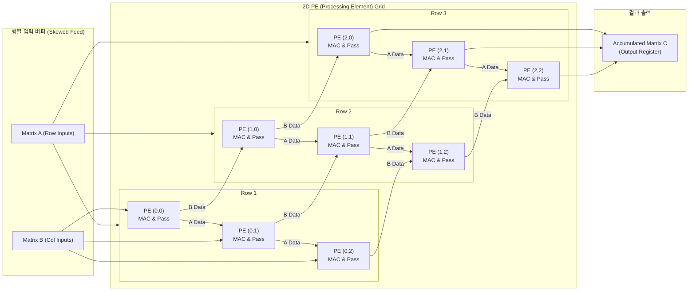

# 시스톨릭 어레이
---

## I. AI 가속을 위한 병렬 행렬 연산 구조, 시스톨릭 어레이의 개요

- 정의: 일정한 클럭 주기에 맞춰 [[PE]] 간 연속적으로 연산을 수행하여 메모리 대역폭 병목을 극복하는 2차원 파이프라인 병렬 하드웨어 아키텍처
- 특징: 폰노이만 병목 극복, 규칙적 데이터 흐름, 행렬 연산 최적화

## II. 시스톨릭 어레이의 아키텍처 및 핵심 기술 요소

### 가. 시스톨릭 어레이의 2차원 연산 아키텍처 및 데이터 흐름

- PE를 거치며 누적 곱산($C \leftarrow C + A \times B$)을 수행하고, 연산 중간값/결과를 내부 파이프라인으로 전달하는 구조임.

### 나. 시스톨릭 어레이의 핵심 구성 요소 및 세부 기술

| **구분**     | **핵심 기술(키워드)**                     | **세부 설명 및 특징**                             |
| ---------- | ---------------------------------- | ------------------------------------------ |
| 연산 유닛      | **PE (Processing Element)**        | 곱셈기, 누산기, 로컬 레지스터                          |
| 연산 유닛      | **MAC Unit (Multiply-Accumulate)** | $A \times B + C$ 연산을 단일/소수 처리하는 핵심 하드웨어 유닛 |
| 데이터 재사용 기법 | **WS (Weight Stationary)**         | 활성화 맵을 흘려주는 방식                             |
| 데이터 재사용 기법 | **OS (Output Stationary)**         | 메모리 쓰기 트래픽을 최소화하는 방식                       |
| 데이터 재사용 기법 | **IS / RS (Input/Row Stationary)** | 입력 활성화 데이터 또는 행렬의 행을 고정                    |
| 타이밍 및 버퍼   | **Skewing Buffer (FIFO)**          | 입력 데이터를 클럭 주기별로 지연 주입                      |
| 타이밍 및 버퍼   | **Unified Buffer / On-chip SRAM**  | 대용량 온칩 고속 SRAM 캐시 계층                       |
| 동기화 및 제어   | **Synchronous Wavefront**          |  동기 제어                                     |

## III. 시스톨릭 어레이와 범용 SIMD/GPU 비교 및 향후 전망

| **비교 항목**                 | **시스톨릭 어레이 (Systolic Array)** | **범용 SIMD / GPU**               |
| ------------------------- | ----------------------------- | ------------------------------- |
| **데이터 이동 방식**             | [[PE]] 간 직접 전달                | 글로벌 레지스터 파일 및 공유 메모리 경유         |
| **메모리 대역폭 요구**            | 극도로 낮음                        | 높음                              |
| **제어 복잡도**                | 단순한 제어 로직, 높은 전력 대 성능비        | 복잡한 명령어 디코더 및 워프 스케줄러 필요        |
| **유연성 (Programmability)** | 행렬 연산(GEMM/Conv)에 특화, 범용성 낮음  | 다양한 범용 병렬 알고리즘 처리에 범용적          |
| **대표 적용 사례**              | Google TPU                    | NVIDIA CUDA Core, AMD RDNA/CDNA |
- 혼합 정밀도(Mixed Precision) 및 희소성(Sparsity) 지원, [[NPU]] 및 AI 가속기 표준 아키텍처 정착