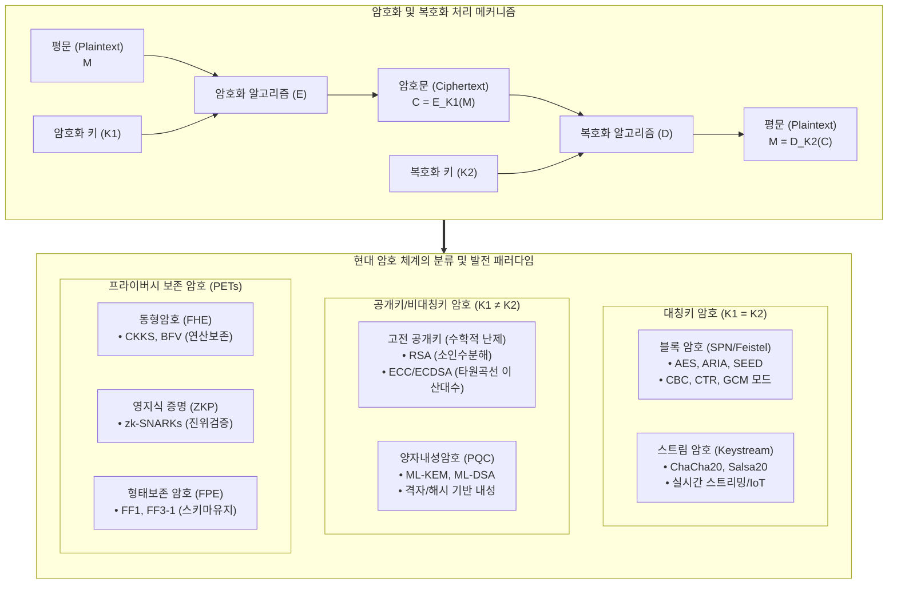

# 암호화 (Encryption)
---

## I. 데이터 기밀성 및 무결성 보장의 핵심 기반, 암호화의 개요

- **정의**: 인가되지 않은 제3자의 도청 및 위·변조를 방지하기 위해 수학적 알고리즘과 암호키(Key)를 적용하여 평문(Plaintext)을 해독 불가능한 암호문(Ciphertext)으로 변환하는 보안 기술
- **특징**: 커크호프의 원리, 혼돈과 확산, [[02_IT_Tech/기밀성|기밀성]](Confidentiality), [[02_IT_Tech/무결성|무결성]](Integrity), 인증(Authentication), 부인방지(Non-repudiation) 제공
---
## II. 암호화의 아키텍처 및 핵심 기술 요소

### 가. 암호화의 참조 아키텍처 및 분류 체계

- 평문과 키를 결합해 기밀성을 확보하며, 현대 암호는 대칭키(고속 대용량 처리)와 공개키(키 교환/인증)의 하이브리드 구조를 기본으로 채택
- 최근 패러다임은 '전송/저장 중 데이터 보호'에서 '사용/연산 중 데이터 보호(Data-in-Use/**동형암호**)' 및 '양자 컴퓨터 공격 방어(PQC)'로 확장
### 나. 암호화의 핵심 기술 요소

| **구분**         | **핵심 기술(키워드)**                    | **세부 설명**                                                                         |
| -------------- | --------------------------------- | --------------------------------------------------------------------------------- |
| **대칭키 (블록)**   | **[[AES]] / [[ARIA]] / [[SEED]]** | SPN(AES/ARIA) 및 Feistel(SEED) 구조 기반 정형 블록(128bit) 단위 암호화, 대용량 DB 및 스토리지 저장 암호화 표준 |
| **대칭키 (스트림)**  | **ChaCha20 / Poly1305**           | 의사난수 비트열(Keystream)과 평문의 XOR 연산, 저전력 모바일 환경 및 TLS 1.3 초고속 전송 패킷 암호화에 최적화          |
| **블록 운용모드**    | **GCM (Galois/Counter Mode)**     | CTR 모드의 병렬 암호화와 Galois 필드 기반 인증 태그 생성을 동시 수행하는 대표적 AEAD(인증 암호화) 표준                |
| **공개키 (인수분해)** | **[[RSA]] (PKCS #1)**             | 큰 소수의 곱을 소인수분해하기 어렵다는 수학적 난제 기반, 키 분배 및 전자서명에 널리 활용(2048~4096bit)                 |
| **공개키 (이산대수)** | **[[ECC]] (ECDH / ECDSA)**        | 타원곡선 이산대수 난제(ECDLP) 기반, RSA 대비 짧은 키 길이(256bit)로 동등한 보안성을 제공하여 모바일/인증서 표준 채택       |
| **형태보존 암호**    | **FPE (Format-Preserving)**       | 암호화 후에도 원본 데이터의 길이, 자릿수, 문자 형식을 그대로 유지(FF1, FF3-1), DB 스키마 수정 없는 개인정보 암호화         |
| **연산보존 암호**    | ****동형암호** (FHE / CKKS)**         | 암호문을 복호화하지 않고 암호화된 상태 그대로 연산(사칙/행렬 연산)을 수행, 민감 의료/금융 데이터 결합 및 AI 추론 보호            |
| ****영지식 증명**** | **ZKP (zk-SNARKs / STARKs)**      | 비밀 정보를 노출하지 않고 해당 정보의 유효성만을 수학적으로 증명하는 알고리즘, DID(분산신원증명) 및 프라이버시 보호               |
| **양자내성 암호**    | **PQC (FIPS 203 / 204)**          | 양자컴퓨터의 쇼어(Shor) 알고리즘에 안전한 격자(ML-KEM, ML-DSA) 기반 차세대 공개키 표준, Crypto-Agility 핵심     |

## III. 암호화 기술 간 비교 및 데이터 전주기 보호 전략

| **비교 항목**    | **[[02_IT_Tech/대칭키 암호화|대칭키 암호]] (Symmetric)**    | **[[02_IT_Tech/비대칭키 암호화|공개키 암호]] (Asymmetric)** | ****동형암호** (Homomorphic)** | **양자내성암호 (PQC)**      |
| ------------ | ----------------------------- | --------------------------- | -------------------------- | --------------------- |
| **암·복호화 키**  | 동일 키 (비밀키 1개)                 | 암호화(공개키) ≠ 복호화(개인키)         | 연산키(Evaluation Key) 활용     | 공개키(PK) ≠ 비밀키(SK)     |
| **보안 기반**    | 블록 라운드 치환/전치                  | 수학적 난제 (소인수/이산대수)           | LWE/RLWE 등 격자 난제           | 고차원 격자, 해시, 코드 난제     |
| **처리 속도**    | 매우 빠름 (Gbps 급)                | 느림 (대칭키 대비 수백 배 지연)         | 매우 느림 (연산 부하 큼, 가속기 필요)    | 중간 (격자 기반 시 고속 처리 가능) |
| **키 관리/분배**  | 사전 안전 채널 공유 필수                | 공개키 자유 배포로 관리 용이            | 연산 주체와 복호화 주체 분리           | 공개키 교환 기반 관리 체계 유지    |
| **주요 보호 대상** | Data-at-Rest, Data-in-Transit | 키 교환, 전자서명, PKI 인증          | **Data-in-Use (연산 중 보호)**  | **양자 시대 통신/인증 인프라**   |

### 나. 데이터 전주기 암호화 및 전환 전략

- **데이터 상태별 전주기(Full Lifecycle) 보호**:
    
      
    - **Data-at-Rest (저장 데이터)**: AES-256-GCM, FPE(주민번호/계좌번호) 적용을 통한 저장소 유출 방지
        
          
        
    - **Data-in-Transit (전송 데이터)**: TLS 1.3 기반 ECDHE/ChaCha20 적용 및 PQC 하이브리드 키 교환 구성
    - **Data-in-Use (사용/연산 데이터)**: 동형암호(CKKS) 및 기밀컴퓨팅(TEE/Enclave)을 결합하여 메모리 상의 원본 데이터 노출 차단
- **암호 민첩성(Crypto-Agility) 확보**: 시스템 중단 없이 암호 알고리즘을 모듈러 방식으로 즉시 교체할 수 있는 구조를 설계하고, 양자컴퓨팅 위협에 대응하여 하이브리드 PQC 전환 로드맵을 단계적으로 수립 필요