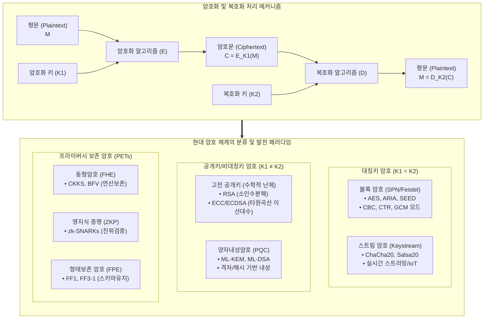

# 암호화 (Encryption)

## I. 데이터 기밀성 및 무결성 보장의 핵심 기반, 암호화의 개요

- **정의**: 인가되지 않은 제3자의 도청 및 위·변조를 방지하기 위해 수학적 알고리즘과 암호키(Key)를 적용하여 평문(Plaintext)을 해독 불가능한 암호문(Ciphertext)으로 변환하는 보안 기술
- **특징**: 커크호프의 원리, 혼돈과 확산, [[02_IT_Tech/기밀성|기밀성]](Confidentiality), [[02_IT_Tech/무결성|무결성]](Integrity), 인증(Authentication), 부인방지(Non-repudiation) 제공
---
## II. 암호화의 아키텍처 및 핵심 기술 요소

### 가. 암호화의 참조 아키텍처 및 분류 체계


```mermaid
flowchart TB
    subgraph PROCESS["암호화 및 복호화 처리 메커니즘"]
        direction LR
        P1["평문 (Plaintext)<br/>M"] --> ENC["암호화 알고리즘 (E)"]
        K1["암호화 키 (K1)"] --> ENC
        ENC --> C["암호문 (Ciphertext)<br/>C = E_K1(M)"]
        C --> DEC["복호화 알고리즘 (D)"]
        K2["복호화 키 (K2)"] --> DEC
        DEC --> P2["평문 (Plaintext)<br/>M = D_K2(C)"]
    end

    subgraph TAXONOMY["현대 암호 체계의 분류 및 발전 패러다임"]
        direction TB
        
        subgraph SYM["대칭키 암호 (K1 = K2)"]
            direction LR
            BLOCK["블록 암호 (SPN/Feistel)<br/>• AES, ARIA, SEED<br/>• CBC, CTR, GCM 모드"]
            STREAM["스트림 암호 (Keystream)<br/>• ChaCha20, Salsa20<br/>• 실시간 스트리밍/IoT"]
        end

        subgraph ASYM["공개키/비대칭키 암호 (K1 ≠ K2)"]
            direction LR
            CLASSIC["고전 공개키 (수학적 난제)<br/>• RSA (소인수분해)<br/>• ECC/ECDSA (타원곡선 이산대수)"]
            PQC["양자내성암호 (PQC)<br/>• ML-KEM, ML-DSA<br/>• 격자/해시 기반 내성"]
        end

        subgraph PETS["프라이버시 보존 암호 (PETs)"]
            direction LR
            FHE["동형암호 (FHE)<br/>• CKKS, BFV (연산보존)"]
            ZKP["영지식 증명 (ZKP)<br/>• zk-SNARKs (진위검증)"]
            FPE["형태보존 암호 (FPE)<br/>• FF1, FF3-1 (스키마유지)"]
        end
    end

    PROCESS ==> TAXONOMY
```

- 평문과 키를 결합해 기밀성을 확보하며, 현대 암호는 대칭키(고속 대용량 처리)와 공개키(키 교환/인증)의 하이브리드 구조를 기본으로 채택
- 최근 패러다임은 '전송/저장 중 데이터 보호'에서 '사용/연산 중 데이터 보호(Data-in-Use/**동형암호**)' 및 '양자 컴퓨터 공격 방어(PQC)'로 확장
### 나. 암호화의 핵심 기술 요소

| **구분**         | **핵심 기술(키워드)**                    | **세부 설명**                                                                         |
| -------------- | --------------------------------- | --------------------------------------------------------------------------------- |
| **대칭키 (블록)**   | **[[AES]] / [[ARIA]] / [[SEED]]** | SPN([[AES]]/ARIA) 및 Feistel([[SEED]]) 구조 기반 정형 블록(128bit) 단위 암호화, 대용량 DB 및 스토리지 저장 암호화 표준 |
| **대칭키 (스트림)**  | **ChaCha20 / Poly1305**           | 의사난수 비트열(Keystream)과 평문의 XOR 연산, 저전력 모바일 환경 및 [[TLS]] 1.3 초고속 전송 패킷 암호화에 최적화          |
| **블록 운용모드**    | **GCM (Galois/Counter Mode)**     | CTR 모드의 병렬 암호화와 Galois 필드 기반 인증 태그 생성을 동시 수행하는 대표적 AEAD(인증 암호화) 표준                |
| **공개키 (인수분해)** | **[[RSA]] (PKCS #1)**             | 큰 소수의 곱을 소인수분해하기 어렵다는 수학적 난제 기반, 키 분배 및 전자서명에 널리 활용(2048~4096bit)                 |
| **공개키 (이산대수)** | **[[ECC]] (ECDH / ECDSA)**        | 타원곡선 이산대수 난제(ECDLP) 기반, [[RSA]] 대비 짧은 키 길이(256bit)로 동등한 보안성을 제공하여 모바일/인증서 표준 채택       |
| **형태보존 암호**    | **FPE (Format-Preserving)**       | 암호화 후에도 원본 데이터의 길이, 자릿수, 문자 형식을 그대로 유지(FF1, FF3-1), DB [[스키마]] 수정 없는 개인정보 암호화         |
| **연산보존 암호**    | ****동형암호** (FHE / CKKS)**         | 암호문을 복호화하지 않고 암호화된 상태 그대로 연산(사칙/행렬 연산)을 수행, 민감 의료/금융 데이터 결합 및 AI 추론 보호            |
| ****영지식 증명**** | **[[영지식증명|ZKP]] (zk-SNARKs / STARKs)**      | 비밀 정보를 노출하지 않고 해당 정보의 유효성만을 수학적으로 증명하는 [[알고리즘]], DID(분산신원증명) 및 프라이버시 보호               |
| **양자내성 암호**    | **PQC ([[FIPS (Federal Information Processing Standards)|FIPS]] 203 / 204)**          | 양자컴퓨터의 쇼어(Shor) 알고리즘에 안전한 격자(ML-KEM, ML-[[DSA]]) 기반 차세대 공개키 표준, Crypto-Agility 핵심     |

---

## III. 암호화 기술 간 비교 및 데이터 전주기 보호 전략

| **비교 항목**    | **[[02_IT_Tech/대칭키 암호화|대칭키 암호]] (Symmetric)**    | **[[02_IT_Tech/비대칭키 암호화|공개키 암호]] (Asymmetric)** | ****동형암호** (Homomorphic)** | **[[양자내성암호]] (PQC)**      |
| ------------ | ----------------------------- | --------------------------- | -------------------------- | --------------------- |
| **암·복호화 키**  | 동일 키 (비밀키 1개)                 | 암호화(공개키) ≠ 복호화(개인키)         | 연산키(Evaluation Key) 활용     | 공개키(PK) ≠ 비밀키(SK)     |
| **보안 기반**    | 블록 라운드 치환/전치                  | 수학적 난제 (소인수/이산대수)           | LWE/RLWE 등 격자 난제           | 고차원 격자, 해시, 코드 난제     |
| **처리 속도**    | 매우 빠름 (Gbps 급)                | 느림 (대칭키 대비 수백 배 지연)         | 매우 느림 (연산 부하 큼, 가속기 필요)    | 중간 (격자 기반 시 고속 처리 가능) |
| **키 관리/분배**  | 사전 안전 채널 공유 필수                | 공개키 자유 배포로 관리 용이            | 연산 주체와 복호화 주체 분리           | 공개키 교환 기반 관리 체계 유지    |
| **주요 보호 대상** | Data-at-Rest, Data-in-Transit | 키 교환, 전자서명, PKI 인증          | **Data-in-Use (연산 중 보호)**  | **양자 시대 통신/인증 인프라**   |

### 나. 데이터 전주기 암호화 및 전환 전략

- **데이터 상태별 전주기(Full Lifecycle) 보호**:
    
      
    - **Data-at-Rest (저장 데이터)**: [[AES]]-256-GCM, FPE(주민번호/계좌번호) 적용을 통한 저장소 유출 방지
        
          
        
    - **Data-in-Transit (전송 데이터)**: TLS 1.3 기반 [[ECDHE]]/ChaCha20 적용 및 PQC 하이브리드 키 교환 구성
    - **Data-in-Use (사용/연산 데이터)**: 동형암호(CKKS) 및 [[기밀컴퓨팅]](TEE/Enclave)을 결합하여 메모리 상의 원본 데이터 노출 차단
- **암호 민첩성(Crypto-Agility) 확보**: 시스템 중단 없이 [[암호 알고리즘]]을 모듈러 방식으로 즉시 교체할 수 있는 구조를 설계하고, 양자컴퓨팅 위협에 대응하여 하이브리드 PQC 전환 로드맵을 단계적으로 수립 필요

---

## I. 정보의 기밀성과 무결성 보장 기술, 암호화의 개요

### 가. 암호화(Encryption)의 정의

- 메시지의 내용을 불명확하게 하기 위해 **평문(Plain Text)**을 알고리즘과 **키(Key)**를 이용하여 재구성하여 **암호문(Cipher Text)**으로 변환하는 기술 [].
- 정보의 **[[기밀성]](Confidentiality)**, **[[무결성]](Integrity)**, **인증(Authentication)** 및 **부인방지(Non-repudiation)**를 제공하는 핵심 보안 메커니즘 [].
### 나. 암호화의 원리 (키워드: 대블치 아호화확) [,]

- **혼돈(Confusion):** 평문과 암호문의 상관관계를 숨김 (키의 1비트 변경이 결과 예측 불가).
- **확산(Diffusion):** 평문의 통계적 특성을 암호문 전반에 확산 (평문 1비트 변경이 암호문 전반에 영향).
- **기타:** 대체(Substitution), 블록화(Blocking), 치환(Transposition), 압축(Compaction), 확장(Expansion).

---

---

## II. 암호화의 분류 및 핵심 기술 비교 (대칭키 vs 비대칭키)

### 가. 암호화 분류 메커니즘 도식화 (차별화: 키의 관계 시각화)

```Plain Text
[ 대칭키 암호화 (Symmetric) ]          [ 공개키 암호화 (Asymmetric) ]
       (비밀키 공유)                        (키 쌍 생성: PK, SK)

   평문 P                                평문 P
     |                                     |
[ 암호화 (Key A) ]                    [ 암호화 (Public Key B) ]
     |                                     |
   암호문 C                              암호문 C
     |                                     |
[ 복호화 (Key A) ]                    [ 복호화 (Private Key B) ]
     |                                     |
   평문 P                                평문 P

<특징: K(E) = K(D)>                  <특징: K(E) ≠ K(D)>
```

- **도식화 포인트:** 대칭키는 **단일 키(Key A)**로 암/복호화를 수행하고, 공개키는 **공개키(PK)**로 암호화하고 **개인키(SK)**로 복호화하는 구조적 차이를 명확히 표현 [].
### 나. 대칭키와 비대칭키(공개키) 암호화 상세 비교 [,,]

| 비교 항목 | 비밀키 암호화 (대칭키) | 공개키 암호화 (비대칭키) |
| --- | --- | --- |
| **키의 관계** | **암호키 = 복호키** (동일) | **암호키 ≠ 복호키** (다름) |
| **키의 수** | *N*×(*N*−1)/2 (관리 복잡) | 2_N_ (관리 용이) |
| **속도** | 빠름 (대용량 데이터 적합) | 느림 (소량 데이터, 키 교환용) |
| **보안성** | 키 배송/공유 문제 존재 | 키 배송 문제 해결, 부인방지 가능 |
| **알고리즘** | **[[DES]], AES, SEED, ARIA** | **[[RSA (Rivest Shamir Adleman)|RSA]], [[ECC]](타원곡선), ElGamal** |
| **처리 단위** | **블록(Block), 스트림(Stream)** | 이산대수, 소인수분해 기반 수학적 연산 |

- *참고:* **하이브리드 방식([[전자봉투]])**: 대용량 데이터는 대칭키로 암호화하고, 그 대칭키를 공개키로 암호화하여 전송하는 방식 사용 [].

---

---

## III. 차세대 암호화 기술 동향 및 발전 방향

### 가. 발전 동향 (동형암호 & PQC)

- **동형암호([[동형 암호|Homomorphic Encryption]]):** 암호화된 상태에서 복호화 없이 연산이 가능한 4세대 암호 기술 (개인정보 보호 강화) [,].
- **[[양자내성암호]](PQC):** 양자 컴퓨터의 연산 속도로 인한 기존 암호체계(RSA 등) 붕괴에 대비하여, 양자 컴퓨터로도 풀기 어려운 수학적 난제(격자, 다변수 등)를 이용한 암호 기술 [].
### 나. 시사점

- 단순 암호화를 넘어, **개인정보 보호(동형암호)**와 **미래 위협 대응(PQC)**을 위한 하이브리드 암호 체계 도입 및 **키 관리 시스템([[KMS]])**의 고도화가 필수적임.
“끝”

---

### 연관 참고 자료

![[notion_2cc44dff397c_{F7621794-FB6E-4B5E-821D-6BA25841D078}.png]]

![[notion_68c44dff397c_{16E7C343-DA37-41A6-B34F-858698A99E13}.png]]

---

## II. 암호화 기술 유형별 상세 비교

|  | 구분 | 핵심 원리 및 알고리즘 | 특성 및 활용 |
| --- | --- | --- | --- |
| 대칭키 | **블록 암호** | 고정 블록 단위(128bit)로 분할 암호화, AES, ARIA | AES-256-GCM 권고 |
|  | **스트림 암호** | 비트/바이트 단위 연속 암호화 | TLS 1.3에서 AES-GCM과 함께 필수 암호 스위트 |
| 비대칭키 | **공개키** | 수학적 난제 기반 키 쌍, RSA, ECC | 키 교환(ECDHE), 전자서명(ECDSA·EdDSA), 인증서(PKI/X.509) |
| 일방향 | **해시 함수** | 임의 길이 입력, SHA-256/SHA-3(Keccak), [[HMAC]] | 무결성 검증, 비밀번호 저장, 전자서명, SHA-256 이상 사용 필수 |
| 대칭 + 비대칭 | **하이브리드 암호 체계** | 비대칭키로 세션키 교환 → 대칭키로 데이터 암호화, 양측의 장점 결합(키관리 편의 + 고속 암호화) | TLS 1.3: ECDHE + AES-256-GCM(데이터 암호화) + SHA-384(무결성), PGP/S-MIME(이메일 암호화), [[IP Sec|IPsec]] [[VPN]], 현대 암호 통신의 사실상 표준 구조 |
|  | **데이터 상태별 암호화** | At Rest·In Transit·In Use 3단계 | At Rest(저장 시): AES-256 디스크·DB·파일 암호화, TDE·FDE, In Transit(전송 시): TLS 1.3·IPsec·SSH 채널 암호화, In Use(사용 시): 동형암호(FHE)·TEE(SGX/SEV) → 연산 중 복호화 없이 처리, 3단계 전체 보호 = 완전한 데이터 보호 |
|  | **키 관리 (Key Management)** | 암호화 시스템의 최약 고리 = 키 관리 | 키 생명주기: 생성→배포→저장→사용→교체→폐기, HSM(Hardware Security Module): 키 물리적 보호, KMS(Key Management Service): 클라우드 키 관리(AWS KMS·Azure Key Vault), 키 교체 주기 정책·키 분리 원칙(용도별 키 분리), BYOK/HYOK: 고객 키 통제 모델 |

---

---

## III. 활용 및 발전 방향

**현행 과제:** [[양자컴퓨터]] 위협 대비 PQC(양자내성암호) 전환 시급(NIST ML-KEM/ML-[[DSA]] 표준 확정 '24.8), CBOM(Crypto Bill of Materials) 기반 암호 자산 인벤토리 구축 → Crypto-Agility 확보

**발전 방향:** 하이브리드 PQC 전환(기존 ECC + ML-KEM 병행 → PQC 단독), 동형암호 실용화 가속으로 In-Use 암호화 보편화, 경량 암호(NIST Lightweight Cryptography: Ascon 표준) IoT·에지 환경 확산, 암호화 자동화(Policy-as-Code 기반 데이터 분류·자동 암호화) 내재화

끝.

---

### 연관 참고 자료

![[notion_34c44dff397c_1000123272.jpg]]

---

### 🔗 연관 토픽

- **소속 도메인**: [[00_보안_MOC|🛡️ 보안]]
- **세부 분류**: `1. 정보보안 원칙 & 거버넌스 · 인증`
- **핵심 연관 토픽**:
  - [[기밀성]]
  - [[VPN|VPN(Virtual Private Network)]]
  - [[암호 알고리즘]]
  - [[IP Sec]]
  - [[DSA]]
