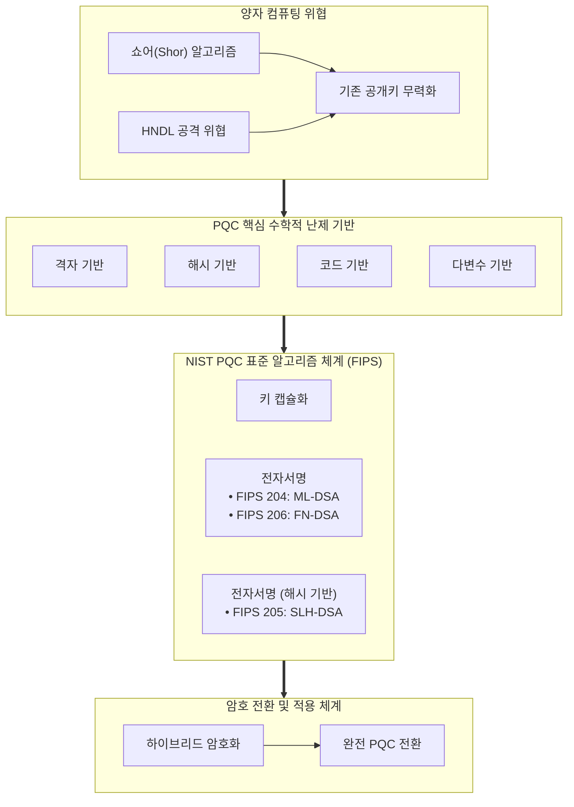

# 양자내성암호 (PQC, Post-Quantum Cryptography)
---
## I. 양자 컴퓨팅 위협 대응을 위한 차세대 공개키 암호, 양자내성암호(PQC)의 개요

- **정의**: [[쇼어 & 그루버 알고리즘|쇼어 & 그로버 알고리즘]]을 탑재한 [[양자컴퓨터]]의 연산 공격에도 안전성을 보장하는 복잡한 수학적 난제 기반의 소프트웨어/하드웨어 구현형 차세대 공개키 암호 체계
- 특징: 'Y2Q(Years to Quantum)' 위협 도래, HNDL(Harvest Now, Decrypt Later) 공격 대응, 알고리즘 대체(Crypto-Agility) 용이
    
---
## II. 양자내성암호(PQC)의 아키텍처 및 핵심 기술 요소

### 가. 양자내성암호의 개념도 및 메커니즘

- 양자 공격에 취약한 고전 수학 난제를 고차원 격자, 해시 함수 트리, 신드롬 디코딩 등의 양자 내성 수학 난제로 전환

### 나. 양자내성암호의 핵심 기술 요소

| **구분**              | **핵심 기술(키워드)**              | **세부 설명**                     |
| ------------------- | --------------------------- | ----------------------------- |
| **다변수 기반 (MQ)**     | **UOV / MAYO**              | 다변수 연립 2차 다항식 해 탐색 난제         |
| **코드 기반 (Code)**    | **Classic McEliece / HQC**  | 오류정정부호 디코딩 난제 기반              |
| **격자 기반 (Lattice)** | **ML-KEM (FIPS 203)**       | 범용 [[TLS]] 키 교환 표준 채택     |
| **격자 기반 (Lattice)** | **ML-DSA (FIPS 204)**       | PKI 인증서 및 전자문서 서명용            |
| **격자 기반 (Lattice)** | **FN-DSA (FIPS 206)**       | 임베디드/펌웨어 특화                   |
| **해시 기반 (Hash)**    | **SLH-DSA (FIPS 205)**      | 보수적 고안전성 표준                   |
| **해시 기반 (Hash)**    | **XMSS / LMS (Stateful)**   | 필수적인 보안 부팅에 적용                |
| **운영/전환 기술**        | **Crypto-Agility (암호 민첩성)** | 동적으로 교체 가능한 모듈러 암호 아키텍처 설계 기법 |

## III. 양자내성암호(PQC) vs 양자키분배(QKD) 비교 및 전환 전략

| **비교 항목**    | **양자내성암호 (PQC)**             | **양자키분배 (QKD)**                        |
| ------------ | ---------------------------- | -------------------------------------- |
| **보안 기반**    | 수학적 계산 복잡도                   | 양자역학 물리 법칙                             |
| **구현 계층**    | 응용/전송 계층                     | 물리 계층                                  |
| **인프라 호환성**  | 기존 인터넷 망 및 하드웨어 100% 재사용 가능  | 전용 다크파이버(암흑광섬유) 및 양자 신뢰노드 신설 필수        |
| **지원 기능**    | **기밀성(KEM) + 인증/부인방지(전자서명)** | **대칭키 분배(Key Distribution)** 단일 기능만 지원 |
| **통신 토폴로지**  | [[End-to-End]] 글로벌 N:N 통신    | [[Point-to-Point]]                     |
| **비용 및 확장성** | 저비용(SW 패치 중심), 높은 확장성        | 고비용(광통신 장비 구축), 노드 확장성 제한              |
- 하이브리드 암호(Hybrid Mode) 우선 적용, K-PQC 및 국가 전환 로드맵 준수