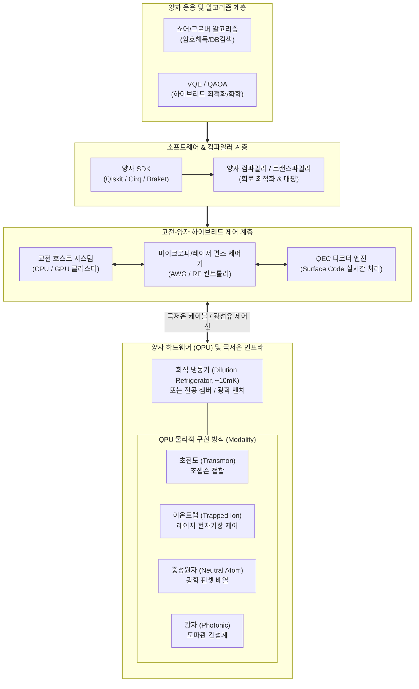

# 양자컴퓨터 (Quantum Computer)

## I. 양자역학 원리 기반 초고속 병렬 연산 체계, 양자컴퓨터의 개요

- **정의**: 큐비트(Qubit)의 중첩(Superposition), 얽힘(Entanglement), 간섭(Interference) 등 양자역학적 현상을 연산 메커니즘으로 활용하여 고전 컴퓨터로 해결 불가능한 난제를 지수적(Exponential) 속도로 해결하는 차세대 컴퓨팅 시스템
    
      
    
- **등장배경 및 필요성**:
    
      
    - **무어의 법칙 한계 극복**: 실리콘 반도체 미세공정의 양자 터널링 한계 도달에 따른 새로운 컴퓨팅 패러다임 요구
        
          
        
    - **복잡계 난제 해결**: 신약 개발, 신소재 분자 시뮬레이션, 복합 물류 최적화 등 지수적 연산량($O(2^n)$) 요구 문제의 초고속 처리
        
          
        
    - **양자 우위(Quantum Advantage) 달성**: 쇼어(Shor) 알고리즘(소인수분해), 그로버(Grover) 알고리즘(비정렬 탐색) 기반 연산 가속
        
          
        

## II. 양자컴퓨터의 아키텍처 및 핵심 기술 요소

### 가. 양자컴퓨터의 계층 아키텍처 및 동작 원리

- 고전 호스트가 양자 회로를 생성·최적화하여 펄스 제어기로 전달하면, QPU 내 큐비트의 상태를 조작하고 측정 결과를 고전 시스템으로 피드백하여 연산 수행
    
      
    

### 나. 양자컴퓨터의 핵심 기술 요소

|**구분**|**핵심 기술(키워드)**|**세부 설명**|
|---|---|---|
|**양자 원리**|**중첩 (Superposition)**|큐비트가 $\Vert{}0\rangle$과 $\Vert{}1\rangle$의 확률적 선형 결합($\Vert{}\psi\rangle = \alpha\Vert{}0\rangle + \beta\Vert{}1\rangle$) 상태로 존재하여 $n$개 큐비트로 $2^n$개 상태 동시 표현|
|**양자 원리**|**얽힘 (Entanglement)**|둘 이상의 큐비트가 공간적 거리와 무관하게 상호 연관되어 한쪽의 측정이 다른 쪽 상태를 즉시 결정하는 비고전적 상관성|
|**하드웨어 (QPU)**|**초전도 (Superconducting)**|조셉슨 접합 기반 인공 원자 회로(Transmon), 게이트 연산 속도가 빠르고 반도체 공정 활용 용이하나 밀리켈빈(10mK) 극저온 환경 필수|
|**하드웨어 (QPU)**|**이온트랩 (Trapped Ion)**|진공 내 전자기장(Paul Trap)으로 포획된 이온에 레이저를 조사하여 제어, 큐비트 결맞음 시간(Coherence Time)이 길고 게이트 정확도가 우수|
|**하드웨어 (QPU)**|**중성원자 (Neutral Atom)**|광학 핀셋(Optical Tweezers)으로 레이저 트랩핑된 원자 제어, 2D/3D 대규모 큐비트 격자 배열 확장에 유리|
|**오류 제어**|**QEC (양자 오류 정정)**|표면 코드(Surface Code), qLDPC 등을 적용하여 다수의 물리 큐비트로 오류를 실시간 탐지·정정하는 결함 허용(FTQC) 핵심 기술|
|**오류 제어**|**논리 큐비트 (Logical Qubit)**|복수의 물리 큐비트(Physical Qubit)를 묶어 잡음과 결어긋남(Decoherence) 없이 장시간 안정적 연산을 수행할 수 있도록 추상화한 큐비트|
|**알고리즘**|**하이브리드 알고리즘 (NISQ)**|VQE(변분 양자 고유값 해결사), QAOA(양자 근사 최적화) 등 QPU와 고전 CPU/GPU를 상호 보완적으로 연계하여 계산을 최적화|
|**소프트웨어**|**양자 컴파일러 & 트랜스파일러**|논리 양자 회로를 QPU의 물리적 토폴로지와 커플링 제약 조건에 맞추어 게이트 재배치 및 최적화 매핑 수행|

## III. 양자컴퓨터 vs 고전컴퓨터 비교 및 발전 전망

### 가. 양자컴퓨터 vs 고전(폰 노이만) 컴퓨터 비교

|**비교 항목**|**양자컴퓨터 (Quantum Computer)**|**고전 컴퓨터 (Classical Computer)**|
|---|---|---|
|**기본 연산 단위**|**큐비트 (Qubit)**: $\Vert{}0\rangle, \Vert{}1\rangle$의 중첩 상태|**비트 (Bit)**: 0 또는 1의 결정론적 2진 상태|
|**연산 원리**|확률 진폭의 중첩, 얽힘, 양자 간섭 기반 병렬 처리|논리 게이트(AND, OR, NOT) 기반 직렬/병렬 처리|
|**데이터 처리 용량**|$n$개 큐비트로 $2^n$개 상태 동시 처리 (지수적 스케일링)|$n$개 비트로 $n$개 상태 순차 처리 (선형적 스케일링)|
|**알고리즘 복잡도**|소인수분해 다항시간($O(n^3)$), 검색 $O(\sqrt{N})$ 가속|소인수분해 준지수시간($O(e^{c\sqrt[3]{n}})$), 검색 $O(N)$|
|**동작 환경**|극저온(10mK), 고진공, 초고도 자기 차폐 인프라 요구|상온 환경(공랭/수랭 쿨링)에서 범용 동작|
|**주요 적용 분야**|암호 해독, 양자 화학 시뮬레이션, 복합 조합 최적화|범용 데이터 처리, 일반 비즈니스 로직, 웹/DB 트랜잭션|

### 나. 양자컴퓨팅 발전 전망 및 기술적 과제

- **NISQ에서 FTQC로의 단계적 진화**: 잡음이 존재하는 중규모 양자(NISQ) 시대를 지나 수천~수만 개의 물리 큐비트를 결합한 **오류 허용 양자컴퓨팅(FTQC) 및 논리 큐비트 상용화 추진**
    
      
    
- **양자 유용성(Quantum Utility) 중심의 하이브리드 인프라**: 슈퍼컴퓨터 클러스터(HPC) 및 GPU 데이터센터에 QPU를 가속 카드로 통합하는 **HPC-Quantum 하이브리드 아키텍처 표준화** 가속
    
      
    
- **보안 패러다임 전환**: 양자컴퓨터 실용화에 대비하여 공개키 암호(RSA, ECC) 체계를 **양자내성암호(PQC, FIPS 203/204)로 신속히 전환하는 크립토 애질리티(Crypto-Agility) 구축 필수**