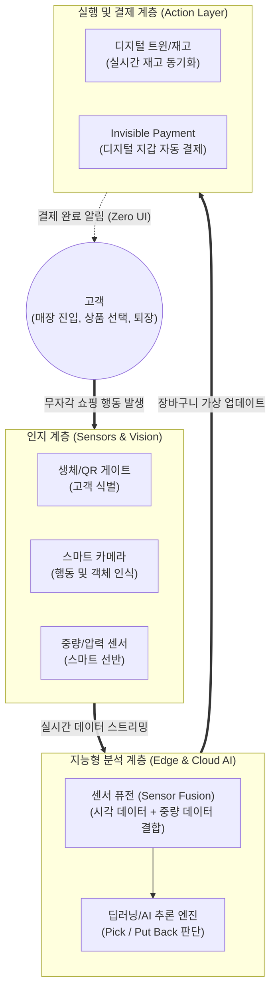

# 엠비언트 커머스 (Ambient Commerce)

---

## I. 제로 클릭 경제를 주도하는 지능형 상거래, 엠비언트 커머스의 개요

* **정의**: 사용자가 앱을 구동하거나 결제를 하는 등 의식적인 쇼핑 행동을 하지 않아도, 일상 환경에 내장된 센서와 AI가 상황을 스스로 인지하여 백그라운드에서 상품 구매와 결제를 자동으로 완료하는 차세대 상거래 패러다임
* **필요성 및 등장배경**:
* **사용자 마찰(Friction) 제로화**: 계산대 대기, 상품 바코드 스캔, 장바구니/결제 [[프로세스]] 등 쇼핑의 물리적·논리적 마찰 요소를 제거하여 심리스(Seamless)한 고객 경험(CX) 요구 증대
* **기반 기술의 성숙**: 컴퓨터 비전(Computer Vision), 스마트 센서(IoT/MEMS), 에지 컴퓨팅([[EDGE|Edge]] Computing), [[에이전틱 AI]] 기술의 발전으로 실시간 무자각 인터페이스 구현 가능

* **특징**: 무자각 결제(Invisible Payment), 무자각 인터페이스(Zero UI), 맥락 인식(Context-Awareness), 선제적 예측 쇼핑(Predictive Shopping)

---

## II. 엠비언트 커머스의 개념도 및 핵심 기술 요소

### 가. 엠비언트 커머스의 시스템 아키텍처 및 동작 원리

* 고객이 매장에 진입하여 상품을 고르고 퇴장하는 모든 과정을 인지 계층의 카메라와 센서가 추적(Tracking)함
* 지능형 분석 계층이 센서 퓨전을 통해 상품의 선택(Pick)과 반환(Put back)을 정확히 판별하여 가상 장바구니에 담고, 고객이 매장을 떠나는 순간 실행 계층에서 백그라운드 자동 결제(Just Walk Out)를 수행함

### 나. 엠비언트 커머스의 핵심 기술 요소

| 구분 | 요소기술(키워드) | 세부 설명 |
| --- | --- | --- |
| **상황 인지** | **Computer Vision** | 매장 천장 등에 설치된 다중 카메라를 통해 고객의 이동 동선, 제스처, 집어 든 상품의 형상을 [[딥러닝]] 기반 실시간 객체 인식 |
| **상황 인지** | **Sensor Fusion** | 컴퓨터 비전의 인식 오류(사각지대 등)를 보완하기 위해, 스마트 선반의 중량 센서(Load Cell) 데이터를 결합하여 교차 검증 |
| **연산/추론** | **Edge Computing** | 방대한 영상 및 센서 데이터의 클라우드 전송 지연을 막고, 매장 내 에지 서버에서 초저지연(Low Latency)으로 고객 행동 추론 |
| **상호작용** | **Zero UI / NUI** | 마우스 클릭이나 바코드 스캔 등 명시적 UI 조작 없이, 고객의 자연스러운 행동(걷기, 짚기) 자체가 시스템의 입력값이 됨 |
| **결제/정산** | **Invisible Payment** | 매장 입장 시 연동된 앱이나 생체 인식(안면, 정맥) 계정을 바탕으로, 퇴장 게이트 통과 즉시 [[핀테크]]/PG사를 통해 무자각 자동 결제 |
| **재고 관리** | **Digital Twin** | 오프라인 매장의 상품 진열 상태와 고객 동선을 가상 공간에 실시간 동기화하여 재고 보충 알림 및 레이아웃 최적화 수행 |
| **자율 쇼핑** | **Agentic AI** | 스마트홈 환경에서 AI 에이전트가 생필품의 소진 패턴을 학습하여, 사용자의 개입(클릭) 없이 자동으로 주문 및 배송을 실행 |
| **통신/추적** | **[[RFID]] / BLE Beacon** | 고가 상품 등에 RFID 태그 또는 블루투스 비콘을 부착하여 카메라 외에도 정밀한 위치 기반 트래킹 제공 |

---

## III. 엠비언트 커머스 패러다임 비교 및 최신 동향

### 가. 전통적 E-Commerce와 Ambient Commerce 비교

| 비교 항목 | E-Commerce (이커머스) | Ambient Commerce (엠비언트 커머스) |
| --- | --- | --- |
| **사용자 개입(상호작용)** | **능동적(Active)** (검색, 장바구니 담기, 클릭) | **수동적/자연적(Passive)** (행동 자체, Zero UI) |
| **결제 방식** | 명시적 결제 (PG 연동, 비밀번호/[[생체 인증]]) | **무자각 결제 (Invisible Payment, 자동 차감)** |
| **쇼핑 공간** | 온라인 (Web, Mobile App) | **온/오프라인 융합 공간** (스마트 매장, 스마트 홈) |
| **핵심 기술 기반** | 추천 [[알고리즘]], [[DBMS]], Web/App 아키텍처 | **Computer Vision, AIoT, Edge AI, Sensor Fusion** |
| **지향점** | 클릭 및 검색 경험 최적화 | **제로 클릭 경제 (Zero-click Economy) 실현** |

### 나. 엠비언트 커머스의 한계점 극복 방안 및 산업 동향

* **프라이버시 침해 우려 해소 (PET 기술 도입)**: 고객의 안면 데이터 및 행동 패턴 상시 수집에 따른 '빅 브라더' 감시 논란을 피하기 위해, 카메라 영상에서 개인 식별 정보를 즉각 [[비식별화]](Anonymization) 처리하고 **연합학습(Federated Learning)** 등 프라이버시 강화 기술(PET) 적용 필수화
* **자율형 에이전트(Autonomous Agent)와의 결합**: 오프라인 무인 매장(Amazon Go 등)을 넘어, 최근에는 가정 내 AI 스피커나 냉장고가 사용자의 음성 발화 문맥과 소비 주기를 분석하여 스스로 장을 보는 '예측형 엠비언트 쇼핑'으로 진화하며 유통 물류 산업의 완전 자동화를 견인 중

---

### 🔗 연관 토픽

- **소속 도메인**: [[00_경영전략_MOC|📈 경영전략]]
- **세부 분류**: `5. IT 투자 성과 평가 & 비즈니스 연속성 계획 (BCP)`
- **핵심 연관 토픽**:
  - [[알고리즘]]
  - [[딥러닝]]
  - [[비식별화]]
  - [[핀테크|핀테크 (FinTech)]]
  - [[RFID]]
