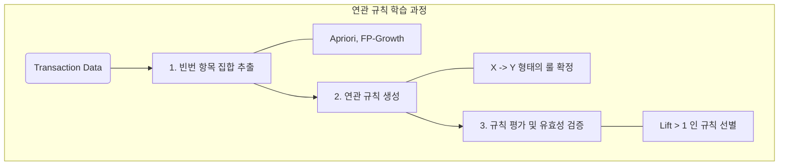

# 연관성 분석 - 데이터 마이닝

대규모 데이터베이스의 트랜잭션 기록에서 항목 간의 의미있는 규칙이나 종속 관계를 발견하는 비지도 학습 기반 데이터 마이닝 기법
지지도, 신뢰도, 향상도, Apriori, FP-Growth, Eclat, Pruning, Transaction DB

---
## 1.  대규모 데이터 속 숨겨진 패턴 탐색, 연관성 분석
- 정의: 데이터 안에 항목들간의 조건 - 결과식으로 표현되는 유용한 패턴들을 나타내는 연관 규칙(Association Rule)을 찾는 분석 기법
- 특징: 비즈니스 통찰력 제공, 조건부 확률기반, 결과 해석의 용이성, [[지지도 - 작성중]], [[신뢰도]], [[향상도]]

---
## 2. 연관성 분석의 동작 페커니즘 및 핵심 기술 요소
### 가. 연관성 분석의 동작원리 및 단계

- 지지도, 신뢰도, 향상도 기반 연관성 분석 수행
### 나. 연관성 분석의 핵심 기술 지표
| 구분        | 키워드              | 설명                           |
| :-------- | :--------------- | :--------------------------- |
| **핵심 지표** | • 지지도            | • $P(A \cap B)$, 가지치기 기준     |
| **핵심 지표** | • 신뢰도            | • $P(B \vert A)$, 규칙의 강도     |
| **핵심 지표** | • 향상도            | • $P(A \cap B) / (P(A)P(B))$ |
| **알고리즘**  | • Apriori     | • 모든 부분집합의 합산             |
| **알고리즘**  | • FP-Growth      | • DB 스캔 횟수 2회             |
| **알고리즘**  | • Eclat          | • 빈발 항목 탐색                   |
| **최적화**   | • Pruning        | • 가지치기를 통한 효율화               |
| **데이터구조** | • Transaction DB | • 행렬 형태로 변환                  |
- 빈발 규칙과 비빈발 규칙은 지지도 기준선 설정

---

## Ⅲ. 유사 기술 비교 및 향후 전망

### 가. 연관성 분석과 협업 필터링 비교

| 비교 항목 | 연관성 분석 | 협업 필터링 |
| :--- | :--- | :--- |
| **분석 대상** | 항목 간의 동시출현 패턴 | 사용자 패턴 유사성 |
| **데이터 형태** | 구매 영수증 | 사용자-평점 행렬 |
| **주요 목적** | 상품 배치, 묶음 판매 | 개인화 상품 추천 |
| **한계점** | 항목 수 늘어나면 힘듦 (연산량 증가) | 콜드스타트 문제 발생 |

#### 나. 최신 동향 및 전망
- 시계열 분석과의 결합, 딥러닝 기반 연관 추출, 실시간 엔진 적용