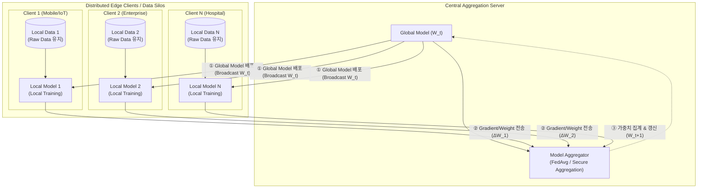

# 연합 학습 (Federated Learning)

## I. 데이터 프라이버시 보호 기반 분산 기계학습, 연합 학습의 개요

- **정의**: 개별 클라이언트(엣지 디바이스/서버)의 원시 데이터(Raw Data)를 외부로 전출하지 않고, 로컬에서 학습된 모델 가중치(Gradient/Weight)만을 중앙 서버로 전송·집계하여 글로벌 모델을 생성하는 분산 머신러닝 패러다임
    
      
    
- **등장배경**: GDPR/개인정보보호법 등 글로벌 규제 강화, 중앙 집중식 데이터 수집에 따른 프라이버시 침해 및 대규모 네트워크 전송 병목 해소 필요
    
      
    
- **특징**: 프라이버시 보존(Privacy-Preserving), 분산 협업 학습(Collaborative Learning), 통신 비용 절감, 데이터 주권 보장
    
      
    

## II. 연합 학습의 아키텍처 및 핵심 기술 요소

### 가. 연합 학습의 개념도 및 동작 메커니즘

- 중앙 서버의 초기 모델 배포 $\rightarrow$ 엣지 디바이스별 로컬 데이터 기반 학습 $\rightarrow$ 모델 파라미터 업로드 $\rightarrow$ 가중치 집계(FedAvg 등) 및 글로벌 모델 업데이트 순환 반복 구조
    
      
    

### 나. 연합 학습의 핵심 기술 요소

|**구분**|**핵심 기술(키워드)**|**세부 설명**|
|---|---|---|
|**집계 알고리즘**|FedAvg (Federated Averaging)|각 클라이언트의 데이터 샘플 수에 비례하여 가중치를 가중평균 집계하는 표준 알고리즘|
|**집계 알고리즘**|FedProx|이기종 하드웨어 및 데이터 비균일성(Non-IID) 환경에서 손실 함수에 근접 항(Proximal Term)을 추가해 수렴성 보장|
|**프라이버시 강화**|Differential Privacy (DP)|그래디언트 전송 시 라플라스/가우시안 노이즈를 주입하여 역공학 기반 원본 데이터 복원 방지|
|**프라이버시 강화**|Secure Aggregation (SecAgg)|[[암호화]] 마스킹 및 SMPC(비밀분산)를 적용하여 개별 파라미터 노출 없이 합산 결과만 서버가 복호화|
|**보안/암호화**|Homomorphic Encryption (HE)|파라미터를 암호화된 상태 그대로 중앙 서버에서 연산/집계할 수 있도록 지원하는 동형암호 기술|
|**통신 최적화**|Model Compression & Quantization|통신 대역폭 절감을 위해 파라미터를 양자화(FP32 $\rightarrow$ INT8)하거나 희소화(Sparsification)하여 전송|
|**분산 아키텍처**|Split Learning|모델 레이어를 쪼개어 일부는 디바이스, 나머지는 서버에서 순차 학습하여 디바이스 연산 부하 경감|
|**신뢰성 보증**|Blockchain-based FL|단일 장애점(SPOF)인 중앙 서버를 탈중앙화하고 학습 기여도에 대한 스마트 컨트랙트 기반 보상 체계 연계|

## III. 연합 학습의 유형 분류 및 당면 과제/발전 방향

### 가. 데이터 분할 형태별 연합 학습 분류

|**구분**|**수평적 연합 학습 (Horizontal FL)**|**수직적 연합 학습 (Vertical FL)**|**연합 [[전이 학습]] (Federated Transfer)**|
|---|---|---|---|
|**데이터 특성**|**특징(Feature) 동일, 사용자(ID) 상이**|**사용자(ID) 동일, 특징(Feature) 상이**|**특징(Feature) 및 사용자(ID) 모두 상이**|
|**적용 시나리오**|지역별 병원 간 동일 질병 진단 모델|동일 고객 대상 은행(금융) + 쇼핑몰(소비) 결합|이종 국가/이종 산업 간 지식 전이 학습|
|**핵심 정렬 기술**|표준화된 동일 [[모델 구조]] 브로드캐스트|Private Set Intersection (PSI, 암호화 교집합 매칭)|도메인 적응(Domain Adaptation) 및 임베딩 전이|

### 나. 한계점 및 향후 발전 방향

- **Non-IID 데이터 편향 극복**: 데이터 불균형 완화를 위한 클러스터형 [[연합학습]](Clustered FL) 및 메타러닝(Meta-Learning) 융합
    
      
    
- **[[적대적 공격]](Adversarial Attack) 방어**: 악의적 클라이언트의 모델 중독(Model Poisoning) 및 백도어 주입 차단을 위한 비잔틴 강건(Byzantine-Robust) 집계 메커니즘 도입 필수
    
      
    
- **온디바이스 AI 융합**: 모바일/자율주행/스마트팩토리 환경에서 [[NPU]] 가속기 최적화 및 경량화(Edge-AI)를 결합한 실시간 연합 학습 생태계로 진화 중