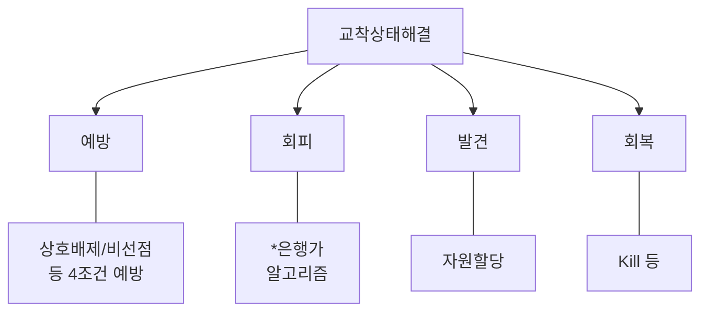
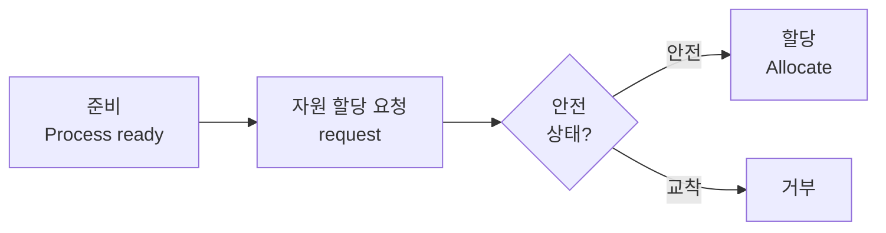
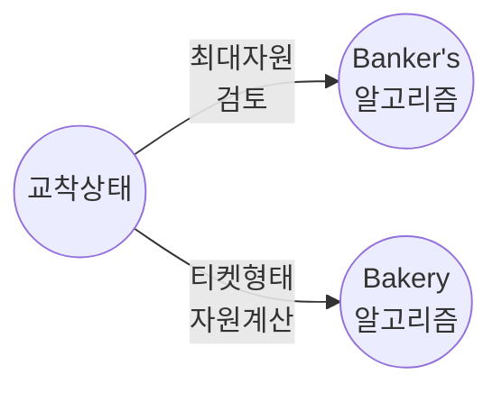

# 은행가 알고리즘
---
## I. 교착상태 회피 알고리즘, 은행가 알고리즘 개요

| 구분 | 내용 |
| :--- | :--- |
| **개념** | 운영체제는 "자원 수 감시"하고 [[프로세스]]는 "자원요청" 하는 [[교착상태]] 회피 알고리즘 |

---
## II. 은행가 알고리즘 동작원리 및 구성요소

### 가. 은행가 알고리즘 동작원리

- Available, Max, Allocation, Need 관리

### 나. 은행가 알고리즘 구성요소 설명

| 구성요소 | 설 명 |
| :--- | :--- |
| **Available** | - 가용한 자원의 수   Available[i,j] = k |
| **Max** | - 최대 자원수, Max[i,j] = k |
| **Allocation** | - 자원 할당 현황   Allocation[i,j] = k |
| **Need** | - 필요 자원수, Need[i,j] = k |
- 기타 bakery 알고리즘으로 교착상태 예방 가능
---
## III. 교착상태 예방 알고리즘, bakery 알고리즘

- Bakery 알고리즘은 자원 대기 순서 티켓형태
