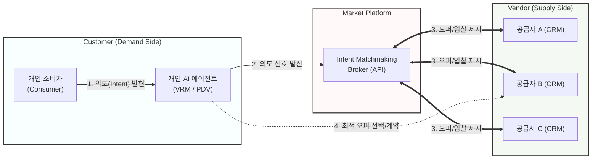

# 의도 경제 (Intention Economy)

---

## I. 사용자 주권과 데이터 기반 매칭의 새 패러다임, 의도 경제의 개요

* **정의**: 소비자가 자신의 구매 의도(Intent)와 선호 데이터를 능동적으로 시장에 공개하고, 공급자(Vendor)가 이를 충족하기 위해 경쟁하는 소비자 주도의 경제 모델.
* **등장 배경**: 무분별한 타겟팅 광고 중심의 주목 경제(Attention Economy) 피로도 증가, [[마이데이터]] 및 개인 데이터 주권 강화 요구, 개인 의도를 파악하는 [[초거대 언어 모델|LLM]] 기반 AI 에이전트의 발전.
* **특징**: 시장 주도권의 역전(공급자 → 소비자), VRM(Vendor Relationship Management) 기반 데이터 직접 통제, 의도 신호 발신 및 맞춤형 입찰(역경매) 구조.

---

## II. 의도 경제의 개념도 및 핵심 기술 요소

### 가. 의도 경제의 개념도 및 동작 원리

* **동작 흐름 1**: 소비자가 개인 AI를 통해 암묵적 니즈를 명시적 의도 신호(Intent Signal)로 변환하여 브로드캐스트 수행
* **동작 흐름 2**: 다수의 공급자는 매칭 플랫폼을 통해 소비자 의도에 부합하는 맞춤형 오퍼를 입찰하고, 소비자가 주도적으로 최적안을 낙찰

### 나. 의도 경제의 핵심 기술 요소

| 구분 | 요소기술(키워드) | 세부 설명 |
| --- | --- | --- |
| **[[프레임워크]]** | **VRM** (Vendor Relationship Mgt.) | - 소비자가 다수 공급자와의 관계, 데이터, 거래 내역을 직접 통합 및 통제하는 시스템 |
| **프레임워크** | **Zero-Party Data** | - 사용자가 능동적, 자발적으로 브랜드 및 플랫폼에 제공하는 취향, 선호도, 구매 의도 데이터 |
| **AI / 지능화** | **Personal AI** (AI 비서) | - 사용자 컨텍스트를 분석하여 초기 단계의 의도를 예측하고 대리 협상하는 초개인화 [[인공지능]] |
| **AI / 지능화** | **Intent Matchmaking** | - 브로드캐스트된 소비자 의도 신호와 공급자의 제품/서비스 카탈로그를 실시간으로 결합하는 [[알고리즘]] |
| **데이터 주권** | **PDV** (Personal Data Vault) | - 중앙화된 플랫폼이 아닌 분산 환경(Solid 프로젝트 등)에 개인 데이터를 독립적으로 안전하게 보관 |
| **보안 / 신원** | **DID** (Decentralized Identifier) | - 제3의 중앙 기관 없이 개인의 신원을 증명하고 데이터의 통제권을 소비자에게 부여하는 탈중앙화 신원증명 |
| **보안 / 신원** | **PET** (Privacy Enhancing Tech) | - 영지식 증명([[영지식증명|ZKP]]) 등을 활용하여 시장에 의도 전달 시 불필요한 개인정보 노출을 원천 차단하는 기술 |
| **계약 / 거래** | **Smart Contract** | - 사전에 정의된 조건 및 의도가 충족되었을 때 플랫폼 종속 없이 거래와 결제를 자동으로 보장하는 [[프로토콜]] |

---

## III. 의도 경제의 패러다임 비교 및 향후 전망

### 가. 의도 경제와 주목 경제(Attention Economy)의 비교

| 비교 항목 | 주목 경제 (Attention Economy) | 의도 경제 (Intention Economy) |
| --- | --- | --- |
| **핵심 자산** | 소비자의 시간과 관심 (Attention) | 소비자의 구체적 목적과 의도 (Intention) |
| **시장 주도권** | 플랫폼 빅테크 및 공급자 (Vendor) | 개인 소비자 (Customer) |
| **마케팅 방식** | 추적 기반 타겟팅 광고, 푸시(Push) 마케팅 | 맞춤형 오퍼 제공, 인바운드(Pull) 마케팅 |
| **데이터 소유** | 기업 (서드파티 행동 추적 데이터 수집) | 개별 사용자 (제로파티 데이터 자발적 제공) |
| **관계 관리** | [[CRM]] (Customer Relationship Management) | VRM (Vendor Relationship Management) |

### 나. 의도 경제의 활성화를 위한 동향 및 향후 과제

* **Agentic AI 기반 한계 극복**: 과거 VRM 개념의 가장 큰 장벽이었던 '사용자의 수동적 의도 입력에 따른 불편함'을 LLM 기반 자율형 AI 에이전트가 해결하며 의도 경제로의 진입이 가속화 중.
* **데이터 상호운용성 및 거버넌스 확립**: 이기종 플랫폼 간 원활한 의도 신호 교환을 위한 표준 API 규격화와 의도 데이터의 무단 도용 및 악용을 방지하기 위한 법적·제도적 안전장치 확보가 필수적임.

---

### 🔗 연관 토픽

- **소속 도메인**: [[00_경영전략_MOC|📈 경영전략]]
- **세부 분류**: `1. 경영 환경 분석 & 전략 수립 프레임워크`
- **핵심 연관 토픽**:
  - [[CRM]]
  - [[인공지능]]
  - [[마이데이터]]
  - [[영지식증명|영지식증명(Zero Knowledge Proof)]]
  - [[그로스 해킹|그로스 해킹(Growth hacking)]]
