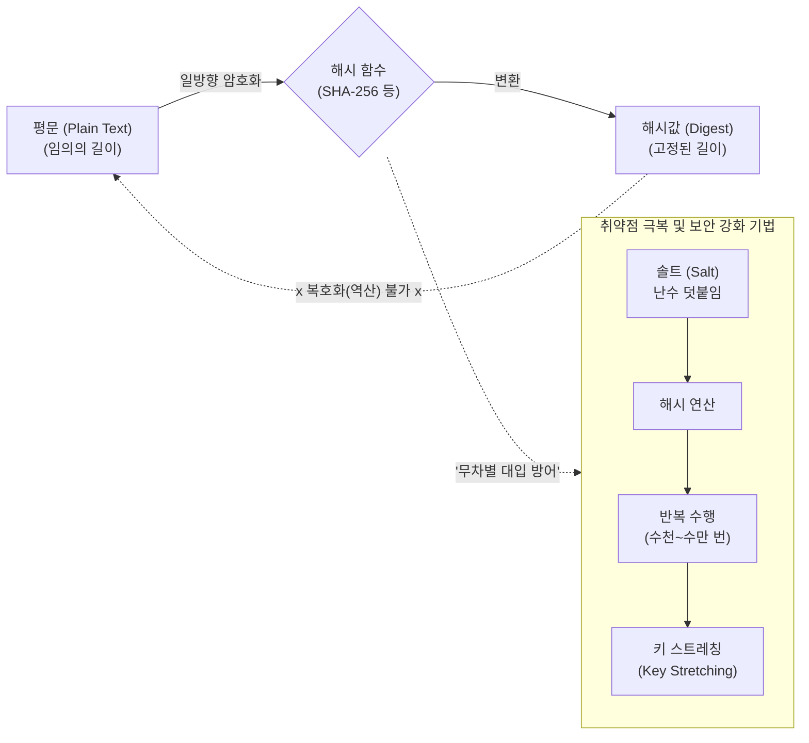

# 일방향 암호화 방식 (One-Way Encryption)

---

## I. 데이터 무결성 및 패스워드 보호의 핵심, 일방향 암호화 방식의 개요

* **정의**: 임의의 길이를 가진 평문 데이터를 고정된 길이의 암호문(해시값, 다이제스트)으로 변환하며, 수학적 연산의 특성상 암호문에서 원래의 평문으로 역산(복호화)하는 것이 불가능한 [[암호화]] [[알고리즘]]
* **등장배경 및 특징**:
* **[[무결성]] 및 인증 필요성 대두**: 메시지 전송 중 위변조 여부 확인 및 사용자 패스워드의 안전한 서버 보관 요구
* **특징**: 복호화 불가(One-Way Function), 고정 길이 출력(Fixed Length), 눈사태 효과(Avalanche Effect), 충돌 회피성(Collision Free)

---

## II. 일방향 암호화 방식의 개념도 및 핵심 기술 요소

### 가. 일방향 암호화 방식의 아키텍처 및 동작 원리

* 평문 입력 시 해시 알고리즘을 통해 다이제스트를 생성하며, 역산 불가 특성으로 인해 패스워드 보관 시 원문을 알 수 없음
* 레인보우 테이블(Rainbow Table) 공격 등을 방어하기 위해 솔팅(Salting)과 키 스트레칭(Key Stretching) 기법을 필수적으로 병행 적용함

### 나. 일방향 암호화 방식의 핵심 기술 및 구성 요소

| 구분 | 요소기술(키워드) | 세부 설명 |
| --- | --- | --- |
| **핵심 보안 요건** | 역상 저항성 (Pre-image Resistance) | - 해시값 $y$가 주어졌을 때, $H(x)=y$를 만족하는 입력값 $x$를 찾는 것이 계산상 불가능해야 하는 특성 |
| **핵심 보안 요건** | 제2역상 저항성 (2nd Pre-image) | - 입력값 $x$가 주어졌을 때, $H(x)=H(x')$를 만족하는 다른 입력값 $x'(x \neq x')$를 찾는 것이 불가능한 특성 |
| **핵심 보안 요건** | 충돌 저항성 (Collision Resistance) | - $H(x)=H(x')$를 만족하는 임의의 두 입력값 $x, x'$를 찾는 것이 계산상 불가능해야 하는 특성 |
| **주요 알고리즘** | SHA-2 / SHA-3 패밀리 | - NSA가 설계한 글로벌 표준 알고리즘(SHA-256/512 등), Keccak 알고리즘 기반의 SHA-3 적용 확대 중 |
| **동작 특성** | 눈사태 효과 (Avalanche Effect) | - 평문의 1비트만 변경되어도 해시 결과값의 절반(50%) 이상이 완전히 다르게 변경되는 예측 불가능성 |
| **보안 강화 기법** | 솔팅 (Salting) | - 평문 패스워드에 임의의 랜덤 문자열(Salt)을 추가하여 해시값을 생성, 레인보우 테이블 공격 무력화 |
| **보안 강화 기법** | 키 스트레칭 (Key Stretching) | - 해시 연산을 수천~수십만 번 반복하여, 무차별 대입 공격(Brute-Force) 시 소요되는 연산 시간을 지연시킴 |
| **응용 분야** | [[HMAC]] / [[블록체인]] PoW | - 송신자 인증을 위한 메시지 인증 코드([[MAC]]) 및 비트코인 등 블록체인 네트워크의 작업증명(PoW)에 활용 |

---

## III. 양방향 암호화 방식과의 비교 및 향후 동향

### 가. 일방향 암호화(해시)와 양방향 암호화 비교

| 비교 항목 | 일방향 암호화 (해시 함수) | 양방향 암호화 (대칭키) | 양방향 암호화 (비대칭키/공개키) |
| --- | --- | --- | --- |
| **핵심 목적** | **무결성 검증, 패스워드 저장** | **[[기밀성]] 보장, 대용량 데이터 암호화** | **기밀성 보장, 키 교환, 전자서명** |
| **복호화 여부** | **불가능** (단방향) | **가능** (양방향) | **가능** (양방향) |
| **사용 키(Key)** | 암호화 키 없음 (일부 MAC 제외) | 암호화와 복호화에 동일한 **단일 비밀키** | 암호화와 복호화에 서로 다른 **공개키/개인키** |
| **처리 속도** | 매우 빠름 | 빠름 | 느림 (복잡한 수학적 연산 수행) |
| **대표 알고리즘** | SHA-256, SHA-3, HAS-160 | [[AES]], ARIA, SEED, LEA | [[RSA (Rivest Shamir Adleman)|RSA]], [[ECC]], ElGamal |

### 나. 일방향 암호화 방식의 최신 트렌드 및 향후 전망

* **양자 내성 해시 알고리즘의 필요성**: 양자 컴퓨터의 쇼어(Shor) 알고리즘 및 그로버(Grover) 알고리즘 등장에 따라 해시 충돌 공격의 위험성이 증가하고 있으며, 이에 대응하기 위해 해시 출력 길이를 2배 이상 늘리는(최소 256비트 이상) 방어 전략과 양자 내성 암호(PQC) 기반의 신규 해시 체계 연구가 가속화되고 있음
* **안전한 패스워드 스토리지 전용 알고리즘 확산**: 단순 SHA-256의 빠른 연산 속도가 도리어 해커의 브루트포스 공격에 유리하게 작용함에 따라, 의도적으로 연산 부하([[CPU]]/Memory Cost)를 유발하는 **Bcrypt, Scrypt, Argon2** 등의 패스워드 전용 해시 알고리즘 채택이 업계 표준으로 자리매김하고 있음

---

### 🔗 연관 토픽

- **소속 도메인**: [[00_보안_MOC|🛡️ 보안]]
- **세부 분류**: `1. 정보보안 원칙 & 거버넌스 · 인증`
- **핵심 연관 토픽**:
  - [[암호화|암호화 (Encryption)]]
  - [[기밀성]]
  - [[HMAC|HMAC (Hash-based Message Authentication Code)]]
  - [[MAC]]
  - [[RSA (Rivest Shamir Adleman)]]
