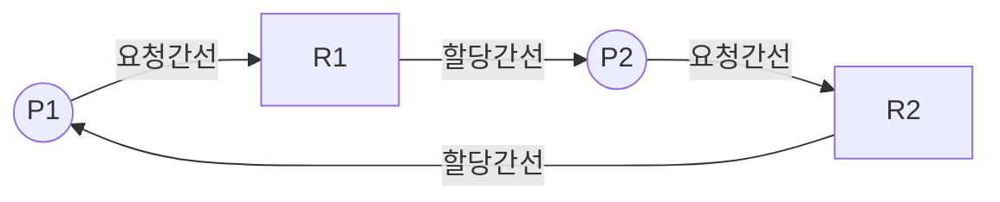

# 자원할당 그래프

## I. 교착상태 시각적 모델링 및 탐지도구, 자원할당그래프 개요

| 구분     | 내용                                                  |
| :----- | :-------------------------------------------------- |
| **정의** | 프로세스와 자원 간의 요청 및 할당 상태를 이분 그래프로 표현하여 교착상태 발생 여부 확인  |
| **특징** | - 정점과 간선의 집합으로 구성 - 그래프 내의 사이클 존재 유무가 교착상태 판정 기준 |

---
## II. 자원할당 그래프의 개념도 및 핵심구성요소
### 가. 자원할당 그래프의 개념도

- $P_1 \to R_1 \to P_2 \to R_2 \to P_1$ 으로 이어지는 사이클 발생은 교착상태
    
### 나. 자원할당 그래프 핵심 구성 요소 및 판별 로직

| **분류**        | **기술** | **도식**          | **설명**                                        |
| ------------- | ------ | --------------- | --------------------------------------------- |
| **정점**        | - 프로세스 | `(Pi)`          | - 자원 요청하는 프로세스                                |
| **정점**        | - 자원   | `[ • ]`         | - 자원들의 집합 표현      - 자원 개수는 점으로 표현 |
| **간선 (Edge)** | - 요청선  | `(Pi) -> [ • ]` | - 자원에 있는 하나의 사각형 점 요청                         |
| **간선 (Edge)** | - 할당선  | `[ • ] -> (Pi)` | - 프로세스는 자원을 할당받아 점유한 상태                       |
- 다이어그램을 통해 자원 할당을 직관적으로 파악

## III. 자원할당 그래프의 최적화 기법 및 최신 트렌드

- **대기 그래프를 통한 단일 인스턴스 환경의 탐지 최적화 수행**
- **마이크로서비스 환경에서 "분산 대기 그래프", "eBPF 및 OpenTelemetry 연계를 통한 확인 및 대응"**
    

![[Pasted image 20260902231753.png]]