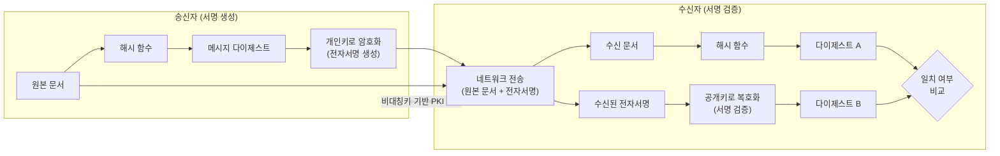

# 전자 서명 (Digital Signature)

---

## I. 무결성 및 부인방지를 위한 전자적 신원증명, 전자 서명의 개요

* **정의**: 전자 문서의 [[무결성]] 검증, 작성자 신원 인증 및 사후 부인방지를 위해 [[비대칭키 암호화]] 방식(PKI)과 해시 함수를 조합하여 생성하는 암호학적 디지털 서명 기술
* **핵심 목적 (보안 3요소)**:
* **무결성(Integrity)**: 전송 중 데이터 위변조 여부 탐지
* **인증(Authentication)**: 서명자(송신자)의 신원 및 정당성 확인
* **부인방지(Non-repudiation)**: 송신자가 서명 사실을 사후에 부인할 수 없도록 통제

---

## II. 전자 서명의 개념도 및 핵심 기술 요소

### 가. 전자 서명의 개념도 및 동작 원리

* 송신자는 원본 문서의 해시값을 자신의 **개인키**로 암호화하여 서명을 첨부하고, 수신자는 송신자의 **공개키**로 복호화한 해시값과 수신 문서의 해시값을 비교하여 검증 수행

### 나. 전자 서명의 핵심 기술 요소

| 분류 | 요소기술(키워드) | 세부 설명 |
| --- | --- | --- |
| **[[암호화]]** | 비대칭키 암호 (PKI) | [[RSA (Rivest Shamir Adleman)|RSA]], [[ECC]] 등 한 쌍의 키(개인키/공개키)를 활용하여 서명 생성 및 검증 수행 |
| **무결성** | 단방향 해시 함수 | SHA-256, SHA-3 등을 사용하여 원본 문서의 고정 길이 축약값(Digest) 생성 |
| **인증 체계** | CA / RA | 공개키 인증서를 발급, 관리, 취소하는 최상위/등록 인증 기관 (인증서 신뢰 보장) |
| **상태 검증** | CRL / OCSP | 폐기된 인증서 목록(CRL) 제공 및 실시간 인증서 유효성 상태 검증(OCSP) |
| **시점 확인** | 타임스탬프 (TSA) | 전자 문서의 생성 시점을 신뢰할 수 있는 제3기관이 증명하여 위조 원천 차단 |
| **간편 인증** | [[FIDO]] (Fast IDentity Online) | 비밀번호 대신 지문, 홍채 등 생체 인식을 결합한 인증 기반 사설 전자 서명 |
| **분산 신원** | DID (Decentralized ID) | 중앙 기관 없이 [[블록체인]] 기반으로 사용자 스스로 신원을 증명하는 차세대 인증 |
| **미래 보안** | PQC 전자 서명 | 양자 컴퓨터 공격에 내성을 갖는 격자/다변수/해시 기반 차세대 암호 서명 [[알고리즘]] |

---

## III. 전자 서명과 MAC 비교 및 향후 전망

### 가. 전자 서명(Digital Signature) vs MAC(Message Authentication Code) 비교

| 비교 항목 | 전자 서명 (Digital Signature) | 메시지 인증 코드 ([[MAC]]) |
| --- | --- | --- |
| **사용 키(Key)** | **비대칭키** (개인키로 서명, 공개키로 검증) | **대칭키** (송/수신자가 동일한 비밀키 공유) |
| **주요 제공 기능** | 무결성, 인증, **부인방지** | 무결성, 인증 |
| **부인방지 제공** | **제공함** (개인키 소유자만 서명 가능하므로) | **제공 불가** (양측이 동일 키를 가지므로 주체 특정 불가) |
| **연산 속도** | 상대적으로 느림 (비대칭키 연산 오버헤드) | 매우 빠름 (대칭키 및 해시 연산) |
| **키 관리/분배** | PKI 기반으로 다수 대상 확장 용이 | 통신 당사자 간 사전 키 분배 필요 (N(N-1)/2) |
| **주요 적용 분야** | 공공/금융 인증서, 전자 계약, 펌웨어 서명 | [[IP Sec|IPsec]], TLS 등 네트워크 통신 패킷 무결성 검증 |

### 나. 전자 서명의 기술 동향 및 산업 적용 전망

* **PQC([[양자내성암호]]) 전환 가속**: 양자 컴퓨터의 쇼어(Shor) 알고리즘에 의한 RSA 붕괴를 대비하여, NIST 표준(Dilithium, Falcon, SPHINCS+) 기반의 PQC 전자 서명으로의 국가/금융 시스템 마이그레이션이 필수 과제로 대두
* **데이터 주권 및 신원 증명 혁신**: 단순 문서 서명을 넘어, 블록체인 기반의 DID 및 VC(Verifiable Credentials)와 결합하여 모바일 신분증, 자격 증명서 등 자기 주권 신원(SSI) 생태계의 핵심 기술로 발전 중

---

### 🔗 연관 토픽

- **소속 도메인**: [[00_디지털서비스_MOC|🚀 디지털서비스]]
- **세부 분류**: `4. 데이터 플랫폼 & 개방형 API 생태계`
- **핵심 연관 토픽**:
  - [[무결성]]
  - [[암호화|암호화 (Encryption)]]
  - [[블록체인|블록체인 (Block Chain)]]
  - [[RSA (Rivest Shamir Adleman)]]
  - [[ECC|ECC(Elliptic Curve Cryptography)]]
