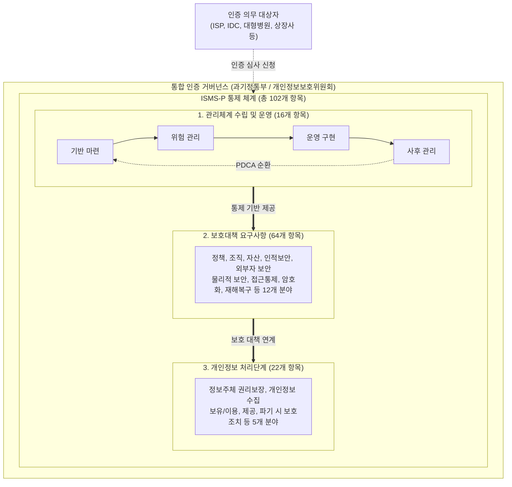

# 정보보호 및 개인정보보호 관리체계 인증 (ISMS-P)

---

## I. 전사적 통합 보안 거버넌스 확립, ISMS-P의 개요

* **정의**: 기업이 정보 자산 및 개인정보를 보호하기 위해 수립, 관리, 운영하는 종합적인 체계가 국내 표준 인증 기준(총 102개 항목)에 적합한지를 심사하여 인증을 부여하는 통합 제도
* **등장배경**: 기존 ISMS(정보보호)와 PIMS(개인정보보호)의 분리 운영에 따른 기업의 중복 인증 부담 해소, 일관된 보안 거버넌스 수립 필요
* **특징**: 통합 인증 심사(비용 및 시간 절감), [[PDCA(Plan-Do-Check-Act, Deming Cycle)|PDCA]](Plan-Do-Check-Act) 기반의 지속적 관리체계 보장, 생명주기(Life-Cycle) 기반 개인정보 보호

---

## II. ISMS-P의 개념도 및 핵심 통제 항목

### 가. ISMS-P의 개념도 및 인증 구조

* 관리체계 수립 영역(16개)을 기반으로, 정보보호 중심의 보호대책(64개)과 개인정보 생명주기 중심의 처리단계(22개) 요구사항을 유기적으로 결합하여 심사 수행

### 나. ISMS-P의 핵심 구성 요소 및 기준

| 구분 | 요소기술(키워드) | 세부 설명 |
| --- | --- | --- |
| **관리체계** | PDCA 라이프사이클 | 기반 마련(P) $\rightarrow$ 위험 관리(D) $\rightarrow$ 운영 구현(C) $\rightarrow$ 사후 관리(A) 순환 구조 |
| **보호대책** | 심층 방어 체계 | 접근통제, [[암호화]], 물리적 보안 등 12개 분야 64개 항목으로 기술적/물리적 보호 |
| **개인정보** | 데이터 생명주기 통제 | 수집 $\rightarrow$ 보유/이용 $\rightarrow$ 제공 $\rightarrow$ 파기 단계별 법적 컴플라이언스 준수 심사 |
| **개인정보** | 정보주체 권리 보장 | 동의 철회권, 열람 청구권 및 최근 개정법에 따른 '자동화된 결정 거부권' 보장 |
| **인증 주체** | KISA / 인증기관 | 정책 관장(과기정통부, 개인정보위), 인증 발급(KISA, 금융보안원), 심사(결제원 등) 분리 |
| **의무 대상** | 매출액 및 이용자수 기준 | 정보통신부문 매출액 100억 이상, 일일 평균 이용자 수 100만 명 이상 등 법정 요건 |
| **의무 대상** | 의료 및 가상자산 | 연매출 1,500억 이상의 대형 병원(상급종합병원) 및 가상자산 사업자(VASP) 필수 포함 |
| **사후 관리** | 갱신 및 사후 심사 | 최초 인증 유효기간 3년, 매년 1회 이상 사후 심사를 통해 체계 유지 여부 점검 |

---

## III. ISMS와 ISMS-P 비교 및 향후 전망

### 가. ISMS vs ISMS-P 체계 비교

| 비교 항목 | ISMS (정보보호 관리체계) | [[ISMS-P]] (정보보호 및 개인정보보호 관리체계) |
| --- | --- | --- |
| **핵심 목적** | 기업의 주요 **정보 자산([[기밀성]], [[HA(High Availability)|가용성]] 등)** 보호 | 정보 자산 보호 + **개인정보 흐름** 전 과정 보호 |
| **적용 범위** | 인프라, 네트워크, 서버 등 일반 IT 인프라 | 일반 IT 인프라 + **개인정보 처리 시스템** (DB, 애플리케이션 등) |
| **인증 기준 수** | 총 **80개** 항목 (관리체계 16개 + 보호대책 64개) | 총 **102개** 항목 (ISMS 80개 + 개인정보 처리 22개) |
| **관장 부처** | 과학기술정보통신부 | 과학기술정보통신부, 개인정보보호위원회 공동 |
| **권장 대상** | B2B 기업, 인프라 제공자 (IDC, [[ISP (Information Strategy Plan)|ISP]] 등) | B2C 기업, 쇼핑몰, [[핀테크]], 대규모 개인정보 취급자 |

### 나. ISMS-P의 최신 제도 동향 및 발전 전망

* **영세·중소기업용 간편인증제 도입**: 기존 102개 인증 항목에 따른 중소기업의 과도한 시간 및 비용 부담을 경감하기 위해, 통제 항목을 핵심 요건 중심으로 경량화한 'ISMS/ISMS-P 간편인증제도'가 본격 도입되어 인증 사각지대 해소 도모
* **클라우드(SaaS) 특화 보안 심사 강화**: [[클라우드 네이티브]] 환경 전환이 가속화됨에 따라, SaaS 기반 제3자 개인정보 위탁 처리 현황 및 클라우드 인프라([[CSP]])와의 책임 공유 모델(Shared Responsibility) 명확성을 ISMS-P 심사의 핵심 통제 요소로 강력히 점검하는 추세임

---

### 🔗 연관 토픽

- **소속 도메인**: [[00_보안_MOC|🛡️ 보안]]
- **세부 분류**: `1. 정보보안 원칙 & 거버넌스 · 인증`
- **핵심 연관 토픽**:
  - [[ISMS-P]]
  - [[기밀성]]
  - [[암호화|암호화 (Encryption)]]
  - [[암호 알고리즘]]
  - [[CSAP|CSAP, CSAP(Cloud Security Assurance Program)]]
