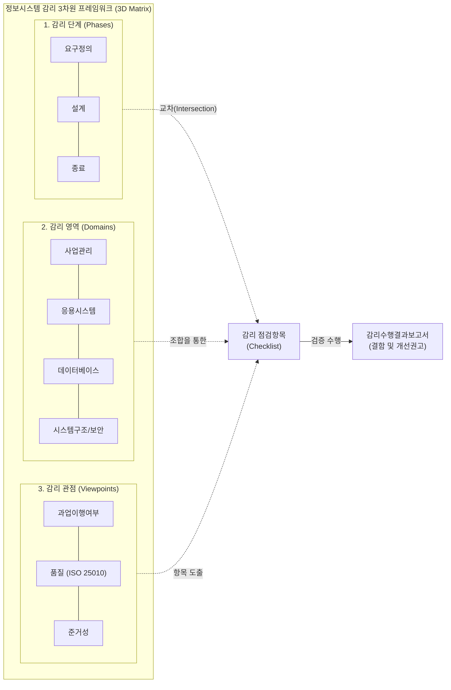

# 정보시스템 감리 프레임워크 (Information System Audit Framework)

---

## I. 공공 IT 사업 점검의 표준 매트릭스, 감리 프레임워크 개요

* **정의**: 정보시스템 감리의 객관성, 일관성, 전문성을 확보하기 위해 감리 대상 사업을 단계(Phase), 영역(Domain), 관점(Viewpoint)의 3차원 매트릭스로 구조화한 표준 점검 체계
* **등장배경**: 감리원 개인의 주관적 경험에 의존한 점검 편차 해소, 복잡화/대형화되는 공공 정보화 사업의 체계적 품질 보증, 법적 규제(전자정부법) 준수를 위한 객관적 기준 필요
* **특징**: 3차원 교차 분석을 통한 사각지대 없는 결함 도출, 사업 유형(구축, 운영, [[유지보수]])에 따른 유연한 [[테일러링]](Tailoring) 지원, 산출물 및 지침 기반의 정량적 평가

---

## II. 정보시스템 감리 프레임워크의 개념도 및 핵심 구성요소

### 가. 감리 프레임워크의 3차원 개념도 및 동작 원리

* 감리 프레임워크는 사업의 진행 시점(단계)마다 전문 영역(도메인)별 감리원이 3가지 평가 기준(관점)을 적용하여 세부 점검 항목을 도출하고 객관적인 감리를 수행하도록 지원함

### 나. 감리 프레임워크의 3대 축 및 핵심 구성 요소

| 구분 | 요소기술(키워드) | 세부 설명 |
| --- | --- | --- |
| **감리 단계** | 요구정의 감리 | 사용자 요구사항의 명확성, 실현 가능성 및 제안서 대비 과업 범위 확정 여부 점검 |
| **감리 단계** | 설계 감리 | 요구사항이 아키텍처 및 시스템 설계서에 누락 없이 반영(추적성)되었는지 점검 |
| **감리 단계** | 종료 감리 | 최종 구현된 시스템의 통합/[[성능 테스트]] 결과 확인 및 이행/운영 전환 준비 점검 |
| **감리 영역** | 사업관리 (PM) | 일정, 비용, 위험, 의사소통, [[형상 관리]] 등 프로젝트 관리 방법론 준수 여부 점검 |
| **감리 영역** | 응용시스템 (App) | 애플리케이션의 기능 적합성, 모듈 간 연계, 사용자 인터페이스(UI/UX) 구현 점검 |
| **감리 영역** | [[데이터베이스]] (DB) | 데이터 모델링 적정성, 정규화/반정규화, 데이터 이관 정합성, 튜닝 상태 점검 |
| **감리 영역** | 시스템구조 및 보안 | H/W, N/W 인프라 구성 적정성, [[시큐어코딩]](47개), 접근통제 등 정보보안 요건 점검 |
| **감리 관점** | 과업이행 / 품질 / 준거성 | 요구사항의 완전한 구현(과업), ISO 25010 기반 시스템 성능/[[신뢰성]](품질), 법·지침 준수(준거성) 측정 |

---

## III. 전통적 프레임워크의 한계 및 차세대 감리 프레임워크 동향

### 가. 폭포수(Waterfall) vs 애자일(Agile) 환경의 감리 프레임워크 비교

| 비교 항목 | 전통적 [[프레임워크]] (Waterfall) | 차세대 프레임워크 ([[Agile]] / Cloud) |
| --- | --- | --- |
| **점검 단계 (Phase)** | 요구 $\rightarrow$ 설계 $\rightarrow$ 종료 (고정적 3단계 점검) | **스프린트(Sprint) 주기별 상시 감리** 결합 |
| **점검 영역 (Domain)** | 사업, 응용, DB, 아키텍처 (인프라 중심) | **[[MSA (Micro Service Architecture)|MSA]] 기반 [[컨테이너]], OpenAPI, [[CSAP]] (클라우드)** 중심 |
| **주요 점검 대상** | 산출물(명세서, 설계서) 문서 대조 및 검토 | **동작하는 소프트웨어 (Working SW)** 및 소스코드 자체 |
| **결함 식별 시점** | 마일스톤(단계) 도달 시 사후 식별 | **CI/CD 파이프라인 내 실시간 식별 (Shift-Left)** |

### 나. 차세대 감리 프레임워크의 발전 방향

* **모듈형 감리 테일러링 프레임워크 확산**: 획일화된 3차원 프레임워크에서 벗어나, 빅데이터, [[인공지능]](AI), 모바일, [[블록체인]] 등 신기술 사업 특성에 맞춰 점검 관점과 도메인을 동적으로 재구성할 수 있는 지능정보화사업 특화 감리 가이드라인 적용 확대
* **[[DevSecOps]] 연계 지능형 프레임워크로의 진화**: 기존 인간 주도의 '점검 관점(Viewpoint)'을 AI 정적 분석([[SAST]]) 및 동적 분석([[DAST]]) 자동화 툴과 연동하여, 객관적인 시스템 품질 지표(버그, 취약점 빈도 등)를 감리 결과 보고서에 실시간 정량화하는 데이터 기반 감리 체계로 고도화 중

---

### 🔗 연관 토픽

- **소속 도메인**: [[00_프로젝트관리_MOC|📋 프로젝트관리]]
- **세부 분류**: `4. 품질 보증 · 위험 관리 & 정보시스템 감리`
- **핵심 연관 토픽**:
  - [[프레임워크]]
  - [[MSA (Micro Service Architecture)]]
  - [[DevSecOps]]
  - [[성능 테스트]]
  - [[시큐어코딩]]
