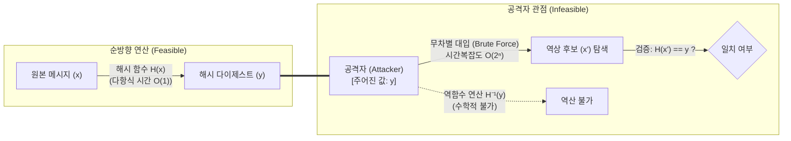

# 제1 역상 저항성 (Pre-image Resistance)

---

## I. 일방향 암호학적 해시 함수의 기본 요건, 제1 역상 저항성의 개요

* **정의**: 암호학적 해시 함수 $H$에서 임의의 해시 결과값 $y$가 주어졌을 때, $H(x) = y$를 만족하는 원본 입력값 $x$를 계산적으로 찾아내는 것이 불가능함을 보장하는 일방향성(One-wayness) 특성
* **특징 및 필요성**:
* **역산 불가성(One-wayness)**: 다이제스트로부터 원문 데이터의 복원 및 역추적을 원천 차단
* **계산 복잡도 보장**: $n$비트 출력 기준 무차별 대입 공격(Brute Force) 복잡도 $O(2^n)$ 요구
* **보안 응용 근간**: 비밀번호 일방향 [[암호화]], [[블록체인]] 작업증명(PoW), 해시 타임락 계약(HTLC)의 기본 전제

---

## II. 제1 역상 저항성의 개념도 및 핵심 기술 요소

### 가. 제1 역상 저항성의 개념도 및 공격 메커니즘

* 공격자는 출력값 $y$만으로 입력값 $x$를 역산할 수 없으며, 유일한 탐색 경로는 $2^n$개의 입력 공간을 전수 대입하는 방식뿐임을 보장

### 나. 제1 역상 저항성의 핵심 기술 요소

| 구분 | 핵심 기술 | 세부 설명 |
| --- | --- | --- |
| **수학적 기반** | **일방향 함수 (One-way Function)** | 순방향 압축 연산은 다항 시간 내 수행되나, 역함수 연산 $H^{-1}(y)$은 계산상 불가능한 비대칭적 복잡도 제공 |
| **복잡도 모델** | **전수 조사 복잡도 ($O(2^n)$)** | $n$비트 해시 출력에 대해 역상을 찾기 위해 평균 $2^{n-1}$, 최대 $2^n$회의 해시 연산 요구 |
| **공격 위협** | **레인보우 테이블 (Rainbow Table)** | 해시 체인과 감축 함수(Reduction Function)를 이용해 시공간 절충(TMTO)으로 사전 계산된 역상을 역추적 |
| **방어 메커니즘** | **솔팅 (Salting)** | 사용자 입력에 고유의 무작위 난수(Salt)를 결합하여 레인보우 테이블 및 사전 공격(Dictionary Attack) 무력화 |
| **방어 메커니즘** | **키 스트레칭 (Key Stretching)** | Argon2id, PBKDF2, bcrypt를 적용해 해시 연산을 수만 회 반복하여 공격자의 전수 대입 연산 비용 극대화 |
| **내부 아키텍처** | **압축 함수 및 스펀지 구조** | Merkle-Damgård(SHA-2)의 단방향 압축 함수, Keccak(SHA-3)의 흡수/압착(Absorb/Squeeze) 치환 구조 적용 |
| **양자 위협** | **그로버 [[알고리즘]] (Grover's Search)** | 양자 중첩 및 진폭 증폭을 통해 무차별 대입 탐색 복잡도를 $O(2^n)$에서 $O(2^{n/2})$으로 자승근(Square Root) 단축 |
| **양자 내성 대응** | **다이제스트 확장 (PQC 대응)** | 그로버 공격에 대비하여 최소 256비트 이상(SHA-256, SHA-3)을 채택하여 최소 128비트 양자 보안 강도 유지 |

---

## III. 해시 함수 3대 보안 특성 비교 및 최신 동향

### 가. 해시 함수의 3대 안전성(저항성) 비교

| 비교 항목 | 제1 역상 저항성 (Pre-image) | [[제2 역상 저항성]] (2nd Pre-image) | 충돌 저항성 (Collision) |
| --- | --- | --- | --- |
| **주어진 조건** | 해시 출력값 $y$만 주어짐 | 특정 입력값 $x$가 주어짐 | 사전 조건 없음 (공격자 임의 선택) |
| **공격 목표** | $H(x) = y$인 임의의 $x$ 탐색 | $x \neq x'$이면서 $H(x) = H(x')$인 $x'$ 탐색 | $x \neq x'$이면서 $H(x) = H(x')$인 임의 쌍 $(x, x')$ 탐색 |
| **고전 복잡도** | $O(2^n)$ (전수 조사) | $O(2^n)$ (전수 조사) | $O(2^{n/2})$ (생일 역설 공격) |
| **양자 복잡도** | $O(2^{n/2})$ (Grover 알고리즘) | $O(2^{n/2})$ (Grover 알고리즘) | $O(2^{n/3})$ (BHT 양자 알고리즘) |
| **대표 공격 기법** | 전수 대입, Rainbow Table | 긴 메시지 확장 공격, Meet-in-the-Middle | Birthday Attack, Differential Cryptanalysis |
| **주요 적용처** | 비밀번호 일방향 저장, PoW, HTLC | 디지털 문서 위변조 방지 | 전자서명(PKI), 인증서 [[무결성]] 검증 |

### 나. 최신 동향 및 기술적 시사점

* **양자 컴퓨터 위협 대응**: 그로버 알고리즘에 의한 복잡도 반감에 따라, NIST 권고 기준 보안 강도 유지를 위해 기존 SHA-1/MD5 퇴출 및 SHA-256/384/512, SHA-3 중심 마이그레이션 필수
* **PQC([[양자내성암호]]) 전자서명 기반**: NIST 표준인 SLH-[[DSA]](SPHINCS+) 등 상태 비저장 해시 기반 서명(Stateless Hash-based Signature)의 안전성 증명 근간으로 제1 역상 저항성이 핵심적으로 활용됨

---

### 🔗 연관 토픽

- **소속 도메인**: [[00_보안_MOC|🛡️ 보안]]
- **세부 분류**: `2. 현대 암호학 & 키 관리 · 전자서명`
- **핵심 연관 토픽**:
  - [[제2 역상 저항성]]
  - [[양자내성암호]]
  - [[암호화|암호화 (Encryption)]]
  - [[DSA]]
  - [[무결성]]
