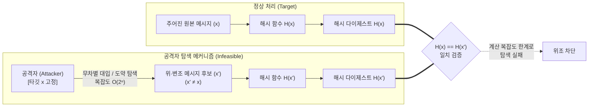

# 제2 역상 저항성 (Second Pre-image Resistance)

---

## I. 전자문서 위·변조 방지의 보루, 제2 역상 저항성의 개요

### 가. 제2 역상 저항성의 정의

* 임의의 입력 메시지 $x$가 주어졌을 때, 암호학적 해시 함수 $H$에 대해 $x \neq x'$이면서 $H(x) = H(x')$를 만족하는 또 다른 대체 메시지 $x'$를 계산적으로 찾아내는 것이 불가능함을 보장하는 특성(약한 충돌 저항성, Weak Collision Resistance)

### 나. 제2 역상 저항성의 필요성 및 특징

* **문서 위·변조 원천 봉쇄**: 원본 문서의 해시값을 유지한 채 악의적 변조 문서로 치환하는 위조 공격 차단
* **선택적 메시지 불가성**: 공격자가 임의의 충돌 쌍을 고르는 충돌 저항성 탐색과 달리, 특정 $x$에 종속되어 공격 복잡도가 극대화됨($O(2^n)$)
* **보안 서비스 신뢰 기반**: 전자서명, 공인인증서, [[블록체인]] 블록 헤더 체이닝 무결성의 전제 조건

---

## II. 제2 역상 저항성의 개념도 및 핵심 기술 요소

### 가. 제2 역상 저항성의 개념도 및 공격 메커니즘

* 공격자는 고정된 원본 $x$와 동일한 해시를 갖는 대체문 $x'$를 찾기 위해 전체 키 공간($2^n$)을 전수 탐색해야 하며, 다항 시간 내 계산 불가능성(Infeasibility)에 의해 위조가 원천 차단됨

### 나. 제2 역상 저항성의 핵심 기술 및 위협 대응 요소

| 분류 | 요소기술(키워드) | 세부 설명 |
| --- | --- | --- |
| **복잡도 모델** | **전수 조사 ($O(2^n)$)** | $n$비트 출력 다이제스트 기준 평균 $2^{n-1}$, 최대 $2^n$회의 해시 연산 비용 소요 |
| **구조적 한계** | **Kelsey-Schneier 공격** | Merkle-Damgård 구조에서 $2^k$ 블록의 긴 메시지에 대해 복잡도가 $k \cdot 2^{n/2} + 2^{n-k+1}$로 감소하는 구조적 취약점 |
| **구조적 한계** | **길이 확장 공격** | 내부 상태를 노출하는 MD 구조 특성을 악용하여 접미사를 추가해도 유효한 해시가 생성되는 위협 |
| **설계 구조 개선** | **HAIFA 구조** | 각 압축 단계마다 블록 카운터(Bit Counter)와 솔트(Salt)를 주입하여 장문 제2 역상 공격 및 확장 공격 원천 방어 |
| **최신 해시 구조** | **Sponge 구조 (Keccak)** | 내부 상태를 Rate($r$)와 Capacity($c$)로 격리하여 상태 전이 유출을 막고, SHA-3에서 제2 역상 저항성 극대화 |
| **공격 완화 기법** | **TCR (Target Collision Resistance)** | 해시 함수 입력 시 키화된 난수(Salt/Mask)를 결합하여 공격자가 타깃 메시지를 사전 분석하지 못하도록 무력화 |
| **양자 위협** | **Grover [[알고리즘]]** | 양자 중첩 및 진폭 증폭을 통해 제2 역상 탐색 복잡도를 $O(2^n)$에서 자승근인 $O(2^{n/2})$으로 축소 |
| **양자 내성 규격** | **[[FIPS (Federal Information Processing Standards)|FIPS]] 205 (SLH-[[DSA]])** | 비상태형 해시 기반 전자서명(SPHINCS+)의 안전성 근간으로 확장 제2 역상 저항성(e-SPR) 엄격 적용 |

---

## III. 해시 함수 3대 특성 비교 및 최신 동향

### 가. 해시 함수의 3대 안전성 비교

| 비교 항목 | [[제1 역상 저항성]] (Pre-image) | 제2 역상 저항성 (2nd Pre-image) | 충돌 저항성 (Collision) |
| --- | --- | --- | --- |
| **주어진 조건** | 출력 다이제스트 $y$ | 특정 입력 메시지 $x$ | 없음 (자유 선택) |
| **공격 목표** | $H(x) = y$인 $x$ 탐색 | $x' \neq x$이면서 $H(x) = H(x')$인 $x'$ | $x \neq x'$이면서 $H(x) = H(x')$인 $(x, x')$ |
| **고전 복잡도** | $O(2^n)$ | $O(2^n)$ (장문 MD 구조 시 저하 가능) | $O(2^{n/2})$ (생일 역설 적용) |
| **양자 복잡도** | $O(2^{n/2})$ (Grover) | $O(2^{n/2})$ (Grover) | $O(2^{n/3})$ (BHT 알고리즘) |
| **파괴 시 영향** | 패스워드 복원, 기밀 데이터 역추적 | 특정 전자계약서 위조, 변조 파일 교체 | 동일 해시 인증서 위조(인증체계 붕괴) |

### 나. 최신 동향 및 기술사적 제언

* **양자 컴퓨터 대비 다이제스트 상향**: 양자 가속에 의한 보안 강도 반감(Security Level Half)에 대응하여 최소 SHA-256 이상, 권장 SHA-384/512 및 SHA-3 표준 적용 필수
* **PQC 표준(SLH-DSA)의 수학적 토대**: NIST FIPS 205 상태 비저장 해시 기반 서명은 순수 해시 함수의 제2 역상 저항성(SPR/e-SPR)에 기반하여 안전성을 증명하므로, 하드웨어 가속기(FPGA/ASIC) 연계 고속 해시 파이프라인 설계가 향후 실무 구현의 핵심 관건임

---

### 🔗 연관 토픽

- **소속 도메인**: [[00_보안_MOC|🛡️ 보안]]
- **세부 분류**: `2. 현대 암호학 & 키 관리 · 전자서명`
- **핵심 연관 토픽**:
  - [[제1 역상 저항성]]
  - [[FIPS (Federal Information Processing Standards)]]
  - [[DSA]]
  - [[ECC|ECC(Elliptic Curve Cryptography)]]
  - [[양자내성암호]]
