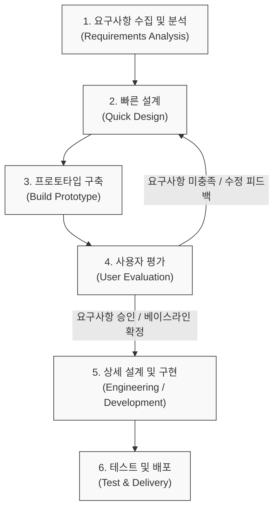

# 프로토타이핑 모델 (Prototyping Model)

---

## I. 요구사항의 불확실성 해소 및 가시화, 프로토타이핑 모델의 개요

* **정의**: 소프트웨어 요구사항을 정확히 파악하기 위해 핵심 기능이 포함된 시제품(Prototype)을 조기에 구축하고, 사용자의 평가와 피드백을 통해 요구사항을 지속적으로 정제해 나가는 소프트웨어 개발 생명주기([[SDLC]]) 모델
* **등장 배경/필요성**: 전통적 [[워터폴|폭포수]] 모델의 요구사항 도출 한계 극복, 후반부 설계 변경에 따른 막대한 재작업(Rework) 비용 예방, 고객과 개발자 간의 의사소통 간극 축소 필요
* **특징**:
* **사용자 중심 참여 (User Involvement)**: 사용자가 직접 작동하는 시제품을 확인하며 실질적인 요구사항 발굴
* **반복적 검증**: 빠른 설계와 구축의 반복(Iteration)을 통해 프로젝트 실패 위험을 조기에 식별 및 최소화

---

## II. 프로토타이핑 모델의 수행 프로세스 및 핵심 기술 요소

### 가. 프로토타이핑 모델의 프로세스 흐름도

* 사용자 평가 단계에서 요구사항이 완전히 충족될 때까지 '빠른 설계-구축-평가'의 순환 루프를 반복하여 불확실성을 제거하고 요구사항 명세서를 확정함

### 나. 프로토타이핑 모델의 분류 및 핵심 요소

| 구분 | 요소기술/유형(키워드) | 세부 설명 |
| --- | --- | --- |
| **구현 목적** | 폐기형 (Throw-away) | 요구사항 검증용으로만 단기적으로 사용하고, 본 개발 시에는 완전히 폐기 후 재개발하는 모델 |
| **구현 목적** | 진화형 (Evolutionary) | 프로토타입을 폐기하지 않고, 지속적인 수정 및 기능 추가를 통해 최종 시스템으로 발전시키는 모델 |
| **구현 목적** | 점진형 (Incremental) | 전체 시스템을 독립적인 여러 프로토타입 모듈로 나누어 순차적으로 구축 후 결합하는 방식 |
| **구현 범위** | 수평적 (Horizontal) | 시스템의 UI 등 표면적인 기능(Front-end)만을 넓게 구현하여 사용자 인터페이스 및 흐름 검증에 집중 |
| **구현 범위** | 수직적 (Vertical) | 특정 기능의 데이터베이스부터 화면(Back-end ~ Front-end)까지 심도 있게 구현하여 핵심 [[알고리즘]] 검증 |
| **지원 도구** | 와이어프레임 (Wireframe) | 화면 흐름과 레이아웃을 선형적인 형태로 빠르게 스케치하여 기획자와 개발자 간의 의사소통 수단으로 활용 |
| **지원 도구** | Low-code / No-code | 복잡한 코딩 없이 UI 기반 툴 및 드래그 앤 드롭을 활용하여 실제 작동 가능한 수준의 프로토타입을 초고속 구축 |

---

## III. 폭포수 모델과의 비교 및 향후 전망

### 가. 폭포수 모델(Waterfall)과 프로토타이핑 모델 비교

| 비교 항목 | [[폭포수 모델]] (Waterfall) | 프로토타이핑 모델 (Prototyping) |
| --- | --- | --- |
| **핵심 사상** | 순차적, 문서(Document) 중심 | 반복적 시제품(Prototype), 피드백 중심 |
| **요구사항 변경** | 수용 곤란 (엄격한 변경 통제 위원회 운영) | 수용 용이 (개발 초기 단계에서 유연하게 변경 가능) |
| **사용자 참여** | 초기(분석) 및 후기([[인수 테스트]])에 집중됨 | 프로젝트 전 수명주기에 걸쳐 지속적이고 적극적 참여 |
| **위험 통제** | 시스템 완성 후반부에 결함 발견 시 위험 및 비용 큼 | 초기 피드백을 통한 선제적 위험 조기 식별 및 해소 |
| **적용 분야** | 요구사항이 명확하고 유사 구축 경험이 풍부한 프로젝트 | 요구사항이 불명확하고 혁신적인 UI/UX가 필요한 프로젝트 |

### 나. 프로토타이핑 모델의 최신 동향 및 향후 전망

* **[[Agile]] 및 [[린 방법론|Lean]] UX와의 융합**: 짧은 스프린트 내에 [[MVP]](Minimum Viable Product)를 구축하여 시장과 고객의 반응을 빠르게 검증하는 애자일(Agile) 방법론의 핵심 프랙티스로 완전히 정착함
* **Design-to-Code 자동화 생태계**: Figma, Propie 등 클라우드 기반 실시간 협업 도구의 발전으로 기획-디자인-개발 간의 경계가 허물어지고 있으며, 디자인된 프로토타입이 React, Flutter 등의 프론트엔드 코드로 즉시 자동 변환되는 생성형 AI 및 로우코드 플랫폼과 융합하여 개발 생산성을 극대화하는 방향으로 진화 중임

---

### 🔗 연관 토픽

- **소속 도메인**: [[00_소프트웨어공학_MOC|🏗️ 소프트웨어공학]]
- **세부 분류**: `1. 소프트웨어 개발 생명주기(SDLC) & 방법론`
- **핵심 연관 토픽**:
  - [[SDLC]]
  - [[폭포수 모델]]
  - [[Agile]]
  - [[워터폴]]
  - [[린 방법론|린 (Lean) 방법론]]
