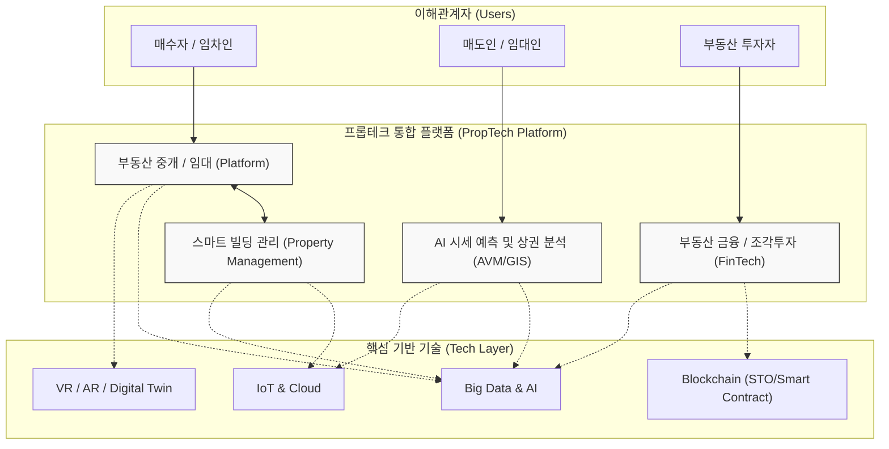

# 프롭테크 (PropTech)

---

## I. 부동산 산업의 디지털 전환을 이끄는 혁신 기술, 프롭테크의 개요

* **정의**: 부동산(Property)과 기술(Technology)의 합성어로, [[인공지능]](AI), 빅데이터, [[블록체인]], VR/AR 등의 첨단 IT 기술을 부동산 기획, 중개, 금융, 관리 전반에 결합하여 혁신적인 비즈니스 모델을 창출하는 신산업
* **등장 배경/필요성**:
* **정보 비대칭성 해소**: 레몬 시장(Lemon Market) 특성이 강한 부동산 시장의 허위 매물 방지 및 거래 투명성 제고
* **소비자 경험 혁신**: 비대면(Untact) 거래 확산, 복잡한 중개 절차 간소화 및 수수료 절감 요구 증대

* **특징**:
* **이종 산업 간의 융합**: 단순 매물 중개를 넘어 [[핀테크]](FinTech), 융합 투자(조각 투자), 스마트시티(IoT) 등 타 산업 기술과의 경계가 허물어지는 빅블러(Big Blur) 현상 심화
* **데이터 중심의 가치 창출**: 경험 의존적인 부동산 평가에서 벗어나, 방대한 실거래가 및 공공데이터를 학습한 AI 기반의 정량적 가치 평가(AVM)로 전환

---

## II. 프롭테크의 개념도 및 핵심 기술 요소

### 가. 프롭테크의 아키텍처 및 서비스 융합 개념도

* 부동산 중개, 금융, 관리 플랫폼이 AI, 블록체인 등의 [[딥테크]](Deep Tech)와 결합하여, 수요자와 공급자를 투명하고 효율적으로 연결하는 데이터 구동형 생태계를 형성함

### 나. 프롭테크의 핵심 기술 및 구성 요소

| 구분 | 요소기술(키워드) | 세부 설명 |
| --- | --- | --- |
| **데이터/AI** | AVM (자동가치산정모형) | [[공공데이터]](실거래가, 지적도 등)와 민간데이터를 딥러닝하여 개별 부동산의 현재 시세 및 미래 가치를 자동 산출하는 [[알고리즘]] |
| **데이터/AI** | 공간 분석 (GIS) | 지리정보시스템(GIS)을 활용하여 상권의 유동 인구, 접근성, 인프라를 공간적으로 시각화하고 최적의 입지를 분석 |
| **실감형 기술** | VR/AR 3D 투어 | 가상/증강현실 기술을 통해 매물 현장을 방문하지 않고도 내부 구조, 인테리어, 조망권 등을 360도로 체험 |
| **실감형 기술** | [[디지털 트윈|디지털 트윈 (Digital Twin)]] | 실제 건물과 동일한 3D 가상 복제본을 구축하여, 일조량 예측, 재난 모의 훈련, 에너지 효율성을 사전 시뮬레이션 |
| **블록체인** | 스마트 컨트랙트 | 분산 원장을 통해 계약 조건을 코딩화하고, 중개인 없이 대금 지급과 소유권 이전을 위변조 없이 자동 집행 |
| **블록체인** | STO (토큰증권발행) | 고가의 상업용 부동산 자산을 블록체인 기반의 디지털 토큰(증권)으로 분할 발행하여 다수의 소액 투자자가 조각 투자 |
| **스마트 관리** | 건물 사물인터넷 (IoT) | 센서를 통해 건물의 온도, 조명, 출입, 에너지 소비 현황을 실시간 수집하고 중앙에서 최적화하는 스마트 빌딩 시스템 |
| **비즈니스 모델** | iBuyer (Instant Buyer) | 프롭테크 플랫폼이 AVM을 통해 매물 가치를 즉시 평가하여 직접 매입하고, 리모델링 후 재판매하는 혁신적 유통 모델 |

---

## III. 프롭테크의 진화 단계 비교 및 향후 전망

### 가. 프롭테크 생태계의 진화 단계 (1.0 ~ 3.0) 비교

| 비교 항목 | 프롭테크 1.0 (과거) | 프롭테크 2.0 (현재) | 프롭테크 3.0 (미래 지향) |
| --- | --- | --- | --- |
| **핵심 인프라** | PC, 웹 (Web) | 모바일 앱 (App), 클라우드 | AI, 블록체인, [[메타버스]] |
| **주요 서비스** | 매물 정보 검색 (온라인 게시판) | O2O 중개 플랫폼 (직방, 다방 등) | 데이터 기반 시세 예측, 자산 유동화 |
| **가치 창출 방식** | 정보의 단순 온라인화 및 비대칭 해소 | 모바일 기반 중개 수수료 및 광고 수익 | AI 가치 평가, 스마트 컨트랙트 자동 거래 |
| **참여 주체** | 정보 제공자, 단순 검색자 | 플랫폼 사업자, 공인중개사, 실사용자 | 데이터 사이언티스트, 글로벌 소액 투자자 |
| **융합 분야** | 순수 부동산 정보 | 부동산 + O2O 서비스 | 부동산 + 핀테크(FinTech) + 콘테크(ConTech) |

### 나. 프롭테크의 최신 동향 및 향후 전망

* **조각투자(STO) 법제화 및 융합 금융 가속화**: 블록체인 기반의 토큰증권(STO) 제도가 제도권에 편입되면서, 상업용 빌딩 및 미술품을 결합한 자산 유동화 플랫폼 시장이 폭발적으로 성장하고 있음
* **ESG 기반 프롭테크 4.0으로의 진화**: 탄소 중립 및 기후 변화 대응을 위해, 건설 단계의 혁신 기술인 콘테크(ConTech, Construction Tech) 및 환경 기술(CleanTech)과 결합하여 건물의 생애주기 전반에 걸친 에너지 효율 극대화 및 지속가능성을 추구하는 ESG 프롭테크 모델이 차세대 글로벌 메가 트렌드로 부상 중임

---

### 🔗 연관 토픽

- **소속 도메인**: [[00_경영전략_MOC|📈 경영전략]]
- **세부 분류**: `2. IT 거버넌스 & 엔터프라이즈 아키텍처 (EA/ISP)`
- **핵심 연관 토픽**:
  - [[핀테크|핀테크 (FinTech)]]
  - [[디지털 트윈|디지털 트윈 (Digital Twin)]]
  - [[딥테크|딥테크 (Deep Tech)]]
  - [[알고리즘]]
  - [[인공지능]]
