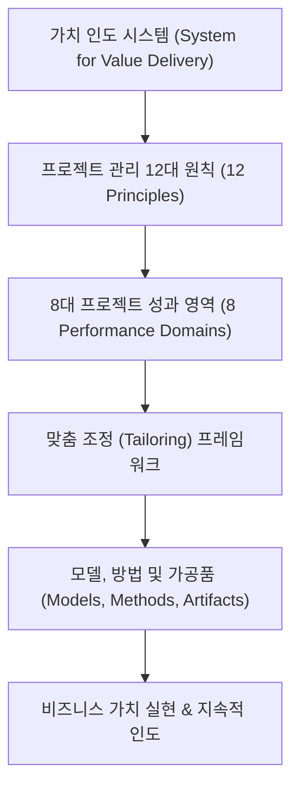

# 📋 03. 프로젝트관리 (PMBOK 7판) 마스터 MOC

> **디지털 가든 허브**: `03_Management` | **소속 지식 노트 수**: **400개**  
> 프로젝트관리지식체계 지침서(PMBOK® Guide) 제7판의 **마지막 공식 색인(도서 255~274페이지, 총 810개 항목)**을 중심으로 용어해설, 8대 성과 영역, 12대 프로젝트 관리 원칙, 모델·방법·가공품을 상호 연결한 지식 체계입니다.

---

## 🗺️ PMBOK 7판 전체 아키텍처 로드맵

---

## 🏛️ 1. 프로젝트 관리 12대 원칙 (The 12 Principles)

> 프로젝트 전문가의 행동과 의사결정을 이끄는 핵심 가치관과 철학입니다.

| 원칙 번호 | 원칙 명칭 | 영문 명칭 | 바로가기 |
| :---: | :--- | :--- | :--- |
| **01** | 스튜어드십 | Be a Diligent, Respectful, and Caring Steward | [[스튜어드십 원칙 (성실하고 배려심 있는 관리자)]] |
| **02** | 협력적 팀 환경 | Create a Collaborative Project Team Environment | [[협력적인 팀 환경 형성 원칙]] |
| **03** | 이해관계자 교류 | Effectively Engage with Stakeholders | [[효과적인 이해관계자 교류 원칙]] |
| **04** | 가치 중점 | Focus on Value | [[가치 중심 인도 원칙]] |
| **05** | 시스템 사고 | Recognize, Evaluate, and Respond to System Interactions | [[시스템 사고 및 상호작용 인식 원칙]] |
| **06** | 리더십 발휘 | Demonstrate Leadership Behaviors | [[리더십 역량 발휘 원칙]] |
| **07** | 맞춤 조정 | Tailor Based on Context | [[상황에 따른 맞춤 조정 원칙 (Tailoring)]] |
| **08** | 품질 체계 구축 | Build Quality into Processes and Deliverables | [[프로세스 및 인도물 품질 체계 구축 원칙]] |
| **09** | 복잡성 탐색 | Navigate Complexity | [[복잡성 탐색 및 관리 원칙]] |
| **10** | 리스크 최적화 | Optimize Risk Responses | [[리스크 대응 최적화 원칙]] |
| **11** | 적응성 및 복원력 | Embrace Adaptability and Resiliency | [[적응성 및 복원력 수용 원칙]] |
| **12** | 변화 주도 | Enable Change to Achieve the Envisioned Future State | [[변화 주도 및 미래 상태 달성 원칙]] |

---

## 🎯 2. 8대 프로젝트 성과 영역 (8 Performance Domains)

> 프로젝트 결과의 효과적인 인도를 위해 상호작용하는 8대 핵심 관리 역량 영역입니다.

| 성과 영역 | 영문 명칭 | 주요 관리 초점 | 바로가기 |
| :--- | :--- | :--- | :--- |
| **이해관계자** | Stakeholder | 이해관계자 식별, 분석, 참여, 만족도 모니터링 | [[이해관계자 성과영역]] |
| **팀** | Team | 프로젝트 팀 문화, 리더십, 역량 개발, 고성과 팀 구축 | [[팀 성과영역]] |
| **개발방식 & 생애주기** | Development Approach & Life Cycle | 예측적/애자일/하이브리드 선택, 인도 케이던스, 단계 심사 | [[개발방식 및 생애주기 성과영역]] |
| **기획** | Planning | 범위·일정·원가 기준선 수립, 자원 및 조달 기획, 연동계획 | [[기획 성과영역]] |
| **프로젝트 작업** | Project Work | 프로세스 운영, 자원 관리, 지식 관리 및 학습, 조달 실행 | [[프로젝트 작업 성과영역]] |
| **인도** | Delivery | 요구사항 충족, 비즈니스 가치 실현, 품질 관리, 범위 완성 | [[인도 성과영역]] |
| **측정** | Measurement | 메트릭(KPI) 설정, 성과측정 기준선(PMB), EVA 분석, 대시보드 | [[측정 성과영역]] |
| **불확실성** | Uncertainty | 모호성, 복잡성, 변동성 대처, 기회 및 위협 리스크 관리 | [[불확실성 성과영역]] |

---

## 🧩 3. 맞춤 조정, 거버넌스 및 조직 체계

- [[맞춤 조정 프레임워크 (Tailoring Framework)|🛠️ 맞춤 조정(Tailoring) 프레임워크]]: 초기 접근방식 선택부터 지속적 개선까지의 4단계
- [[프로젝트관리오피스(PMO)|🏢 프로젝트관리오피스(PMO)]]: 지원형, 통제형, 지시형 PMO의 가치 제안
- [[가치인도오피스(VDO)|🚀 가치인도오피스(VDO)]]: 가치 흐름 최적화 중심의 차세대 PMO
- [[프로젝트 스폰서 (Project Sponsor)|🤝 프로젝트 스폰서 (Project Sponsor)]]: 재정 자원 조달 및 전략적 정렬 지원
- [[제품 관리 (Product Management)|📦 제품 관리 (Product Management)]]: 프로젝트와 프로덕트 생애주기의 융합
- [[가치 인도 시스템 (System for Value Delivery)|🌐 가치 인도 시스템 (System for Value Delivery)]]: 전략-포트폴리오-프로젝트 연계

---

## 📐 4. 주요 모델 (Models)

| 분류 | 모델 명칭 | 주요 특징 |
| :--- | :--- | :--- |
| **상황적 리더십** | [[상황적 리더십 II 모델]] | 팀원 성숙도에 따른 지시·코칭·지원·위임 스타일 조정 |
| **코칭 & 멘토링** | [[OSCAR 코칭 및 멘토링 모델]] | Outcome, Situation, Choices, Action, Review 5단계 코칭 |
| **의사소통** | [[의사소통 채널 효율성 모델]] | 대면 소통의 풍부도와 문서 소통의 차이 분석 |
| **동기부여** | [[허츠버그 위생 및 동기부여 모델]] | 불만 예방(위생)과 몰입 촉진(동기)의 2요인 분리 |
| **동기부여** | [[맥클랜드 성취동기 이론]] | 성취 욕구(nAch), 권력 욕구(nPow), 친교 욕구(nAff) |
| **동기부여** | [[내재적 동기부여 대 외재적 동기부여]] | 자율성(Autonomy), 숙련(Mastery), 목적의식(Purpose) |
| **동기부여** | [[맥그리거 X-Y 이론 및 Ouchi Z 이론]] | 인간 본성에 대한 관리자의 관점과 권한 위임 |
| **변경 관리** | [[ADKAR® 변경 모델]] | 개인 중심의 5단계 변화 관리 (Awareness ~ Reinforcement) |
| **변경 관리** | [[코터 8단계 변경 모델]] | 조직 차원의 전략적 변혁을 이끄는 8단계 로드맵 |
| **변경 관리** | [[버지니아 사티어 변화 모델]] | 외래 요소 도입 시 겪는 혼돈(Chaos)과 신기원 극복 |
| **변경 관리** | [[브리지스 전환 모델]] | 상황적 변화와 내면적 심리 전환(끝맺음-중립-새시작) 구분 |
| **복잡성** | [[스네핀 프레임워크]] | 명확, 복잡, 복합, 혼돈, 혼란의 5대 상황 의사결정 |
| **복잡성** | [[스테이시 복잡성 매트릭스]] | 요구사항과 기술 확실성에 따른 개발 방식 결정 |
| **팀 개발** | [[터크먼 사다리 모델]] | 형성기(Forming) ~ 격동기 ~ 규범기 ~ 성과기 ~ 해산기 |
| **팀 개발** | [[드렉슬러-시벳 팀 성과 모델]] | 팀 창조와 지속적 성과 창출의 7단계 프로세스 |
| **갈등 해결** | [[토마스-킬만 갈등 해결 모델]] | 협력, 타협, 수용, 경쟁, 회피의 5대 갈등 대처 모드 |
| **이해관계자** | [[이해관계자 현저성 모델]] | 권력(Power), 긴급성(Urgency), 정당성(Legitimacy) 분류 |
| **프로세스** | [[프로세스 그룹 모델]] | 전통적 5대 프로세스 그룹(착수·기획·실행·감시및통제·종료) |

---

## 📊 5. 핵심 가공품 및 방법론 (Artifacts & Methods)

### 핵심 기준선 및 계획서
- [[범위 기준선]], [[일정 기준선]], [[원가 기준선]], [[성과측정 기준선(PMB)]]
- [[작업분류체계(WBS)]], [[WBS 사전]], [[작업기술서(SOW)]]
- [[프로젝트관리 계획서]], [[품질관리 계획서]], [[리스크관리 계획서]]

### 산정 및 성과 측정 기법
- [[주공정법(CPM)]], [[획득가치분석(EVA)]], [[3점 산정]], [[유사산정]]
- [[계획가치(PV)]], [[획득가치(EV)]], [[실제원가(AC)]]
- [[원가성과지수(CPI)]], [[일정성과지수(SPI)]], [[완료시점산정치(EAC)]]

### 핵심 차트 및 시각화 도구
- [[간트 차트]], [[번다운 차트]], [[번업 차트]], [[누적흐름도(CFD)]]
- [[칸반 보드]], [[RACI 차트]], [[S-곡선]], [[원인결과도]]

---

## 🔤 6. 핵심 약어 총람 (Acronyms Table)

| 약어 (Acronym) | 국문 표제어 | 영문 명칭 |
| :--- | :--- | :--- |
| **AC** | 실제원가 | Actual Cost |
| **BAC** | 완료시점예산 | Budget at Completion |
| **CCB** | 변경통제위원회 | Change Control Board |
| **CFD** | 누적흐름도 | Cumulative Flow Diagram |
| **COQ** | 품질비용 | Cost of Quality |
| **CPI** | 원가성과지수 | Cost Performance Index |
| **CPM** | 주공정법 | Critical Path Method |
| **CV** | 원가차이 | Cost Variance |
| **DoD** | 완료 정의 | Definition of Done |
| **EAC** | 완료시점산정치 | Estimate at Completion |
| **EEF** | 기업환경요인 | Enterprise Environmental Factors |
| **EMV** | 기대화폐가치 | Expected Monetary Value |
| **ETC** | 잔여분산정치 | Estimate to Complete |
| **EV** | 획득가치 | Earned Value |
| **EVA** | 획득가치분석 | Earned Value Analysis |
| **FFP** | 확정고정가 | Firm Fixed Price |
| **MVP** | 최소 기능 제품 | Minimum Viable Product |
| **OBS** | 조직분류체계 | Organizational Breakdown Structure |
| **OPA** | 조직 프로세스 자산 | Organizational Process Assets |
| **PMB** | 성과측정 기준선 | Performance Measurement Baseline |
| **PMO** | 프로젝트관리오피스 | Project Management Office |
| **PV** | 계획가치 | Planned Value |
| **RAM** | 책임배정매트릭스 | Responsibility Assignment Matrix |
| **RBS** | 리스크분류체계 | Risk Breakdown Structure |
| **SOW** | 작업기술서 | Statement of Work |
| **SPI** | 일정성과지수 | Schedule Performance Index |
| **SV** | 일정차이 | Schedule Variance |
| **SWOT** | 강점, 약점, 기회, 위협 | SWOT Analysis |
| **VAC** | 완료시점차이 | Variance at Completion |
| **VDO** | 가치인도오피스 | Value Delivery Office |
| **WBS** | 작업분류체계 | Work Breakdown Structure |

---

